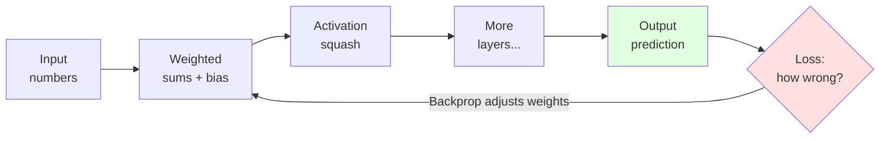
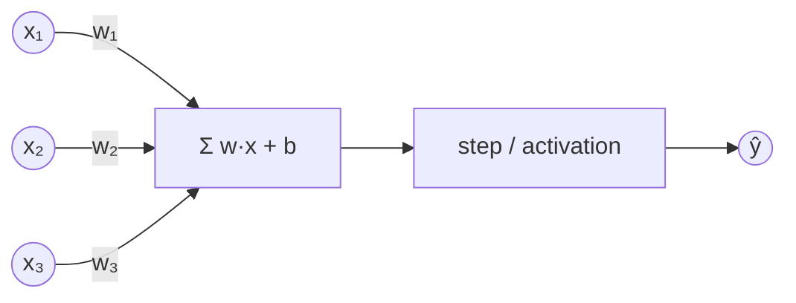
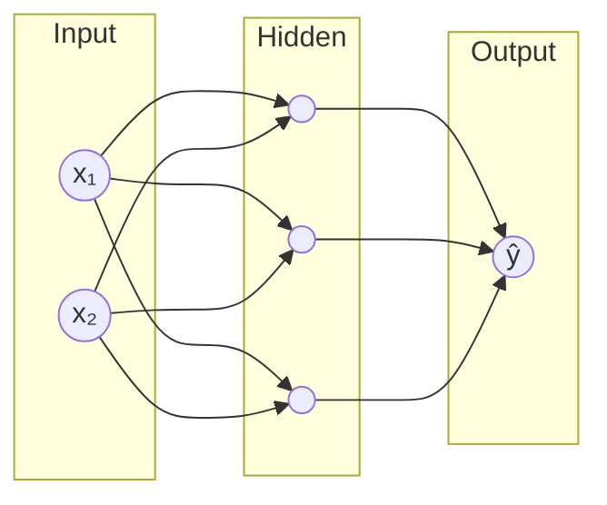
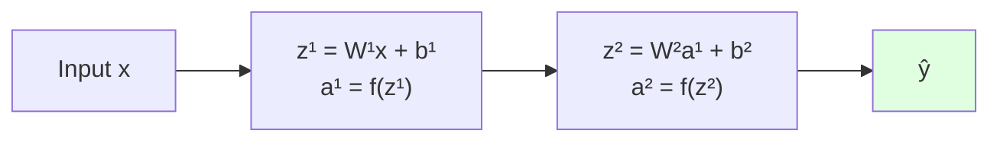
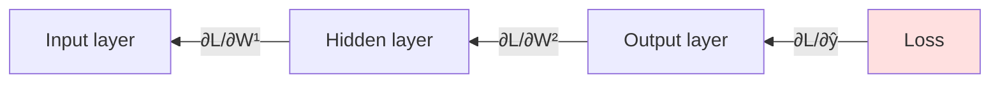
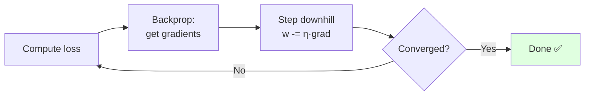
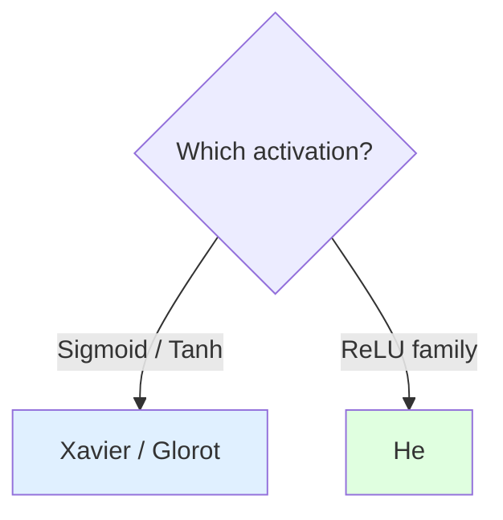
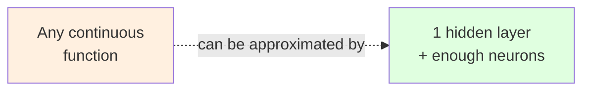
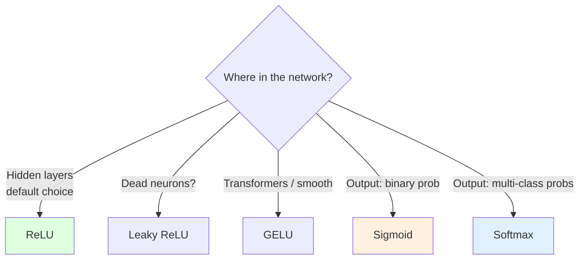

# Neural Network Learning Roadmap

> A structured path from perceptron fundamentals to LLM systems.

---

## Table of Contents

- [1. Neural Network Fundamentals](#1-neural-network-fundamentals)
  - [What is a Neural Network?](#what-is-a-neural-network)
  - [Perceptron](#perceptron)
  - [Multi-Layer Perceptron (MLP)](#multi-layer-perceptron-mlp)
  - [Forward Propagation](#forward-propagation)
  - [Backpropagation](#backpropagation)
  - [Chain Rule](#chain-rule)
  - [Gradient Descent](#gradient-descent)
  - [Loss Functions](#loss-functions)
    - [MSE](#mse)
    - [Cross-Entropy](#cross-entropy)
  - [Weight Initialization](#weight-initialization)
    - [Xavier / Glorot Initialization](#xavier--glorot-initialization)
    - [He Initialization](#he-initialization)
  - [Bias](#bias)
  - [Universal Approximation Theorem](#universal-approximation-theorem)

- [2. Activation Functions & Optimization](#2-activation-functions--optimization)
  - [Activation Functions](#activation-functions)
    - [Sigmoid](#sigmoid)
    - [Tanh](#tanh)
    - [ReLU](#relu)
    - [Leaky ReLU](#leaky-relu)
    - [GELU](#gelu)
    - [Softmax](#softmax)
  - [Optimization](#optimization)
    - [Batch, Mini-Batch & SGD](#batch-mini-batch--sgd)
    - [Momentum](#momentum)
    - [AdaGrad](#adagrad)
    - [RMSProp](#rmsprop)
    - [Adam](#adam)
    - [AdamW](#adamw)
    - [Learning Rate Scheduling](#learning-rate-scheduling)

- [3. Training Challenges & Regularization](#3-training-challenges--regularization)
  - [Challenges](#challenges)
    - [Vanishing Gradient](#vanishing-gradient)
    - [Exploding Gradient](#exploding-gradient)
    - [Dead ReLU](#dead-relu)
    - [Overfitting](#overfitting)
    - [Underfitting](#underfitting)
    - [Bias-Variance Tradeoff](#bias-variance-tradeoff)
  - [Regularization](#regularization)
    - [L1 vs L2 (Weight Decay)](#l1-vs-l2-weight-decay)
    - [Dropout](#dropout)
    - [Early Stopping](#early-stopping)
    - [Data Augmentation](#data-augmentation)
    - [Label Smoothing](#label-smoothing)
  - [Normalization](#normalization)
    - [BatchNorm](#batchnorm)
    - [LayerNorm](#layernorm)
    - [Residual Connections](#residual-connections)

- [4. Convolutional Neural Networks (CNNs)](#4-convolutional-neural-networks-cnns)
  - [Concepts](#cnn-concepts)
    - [Convolution](#convolution)
    - [Kernel / Filter](#kernel--filter)
    - [Padding](#padding)
    - [Stride](#stride)
    - [Pooling](#pooling)
    - [Receptive Field](#receptive-field)
    - [Depthwise Separable Convolution](#depthwise-separable-convolution)
    - [Dilated Convolution](#dilated-convolution)
  - [Architectures](#cnn-architectures)
    - [ResNet](#resnet)
    - [EfficientNet](#efficientnet)

- [5. Sequence Models](#5-sequence-models)
  - [RNN](#rnn)
  - [Bidirectional RNN](#bidirectional-rnn)
  - [LSTM](#lstm)
  - [GRU](#gru)
  - [Seq2Seq](#seq2seq)

- [6. Attention & Transformers](#6-attention--transformers)
  - [Attention](#attention)
    - [Query, Key, Value](#query-key-value)
    - [Scaled Dot-Product Attention](#scaled-dot-product-attention)
    - [Self-Attention](#self-attention)
    - [Multi-Head Attention](#multi-head-attention)
    - [Cross-Attention](#cross-attention)
  - [Transformer Architecture](#transformer-architecture)
    - [Encoder](#encoder)
    - [Decoder](#decoder)
    - [Positional Encoding](#positional-encoding)
    - [Feed Forward Network](#feed-forward-network)
    - [Masked Attention](#masked-attention)
  - [Variants](#transformer-variants)
    - [Encoder-only](#encoder-only)
    - [Encoder-Decoder](#encoder-decoder)
    - [Decoder-only](#decoder-only)

- [7. Embeddings & Evaluation](#7-embeddings--evaluation)
  - [Embeddings](#embeddings)
    - [One-Hot Encoding](#one-hot-encoding)
    - [Word2Vec](#word2vec)
    - [GloVe](#glove)
    - [Learned Embeddings](#learned-embeddings)
  - [Evaluation Metrics](#evaluation-metrics)
    - [Accuracy](#accuracy)
    - [Precision](#precision)
    - [Recall](#recall)
    - [F1-score](#f1-score)
    - [ROC-AUC](#roc-auc)
    - [Perplexity](#perplexity)

- [8. Practical Deep Learning](#8-practical-deep-learning)
  - [Transfer Learning](#transfer-learning)
  - [Fine-Tuning](#fine-tuning)
  - [Hyperparameter Tuning](#hyperparameter-tuning)

- [9. Large Language Models (LLMs)](#9-large-language-models-llms)
  - [LLM Fundamentals](#llm-fundamentals)
    - [What is a Language Model?](#what-is-a-language-model)
    - [What is an LLM?](#what-is-an-llm)
    - [Next-Token Prediction](#next-token-prediction)
    - [Autoregressive Generation](#autoregressive-generation)
    - [Tokenization](#tokenization)
    - [Context Window](#context-window)
    - [Decoding Strategies](#decoding-strategies)
  - [Training](#llm-training)
    - [Pretraining](#pretraining)
    - [Supervised Fine-Tuning (SFT)](#supervised-fine-tuning-sft)
    - [Instruction Tuning](#instruction-tuning)
    - [In-Context Learning](#in-context-learning)
    - [RLHF](#rlhf)
    - [DPO](#dpo)
  - [Efficient Fine-Tuning](#efficient-fine-tuning)
    - [LoRA](#lora)
    - [QLoRA](#qlora)
    - [PEFT](#peft)
  - [LLM Systems](#llm-systems)
    - [Scaling Laws](#scaling-laws)
    - [Mixture of Experts (MoE)](#mixture-of-experts-moe)
    - [KV Cache](#kv-cache)

- [10. High-Frequency Interview Comparisons](#10-high-frequency-interview-comparisons)
  - [Sequence Models](#sequence-model-comparisons)
    - [CNN vs RNN](#cnn-vs-rnn)
    - [RNN vs LSTM](#rnn-vs-lstm)
    - [LSTM vs GRU](#lstm-vs-gru)
    - [RNN vs Transformer](#rnn-vs-transformer)
  - [Transformers & LLMs](#transformer-llm-comparisons)
    - [Attention vs Self-Attention](#attention-vs-self-attention)
    - [Encoder-only vs Encoder-Decoder vs Decoder-only](#encoder-only-vs-encoder-decoder-vs-decoder-only)
    - [LM vs LLM](#lm-vs-llm)
    - [Pretraining vs Fine-Tuning](#pretraining-vs-fine-tuning)
    - [Instruction Tuning vs In-Context Learning](#instruction-tuning-vs-in-context-learning)
    - [LoRA vs Full Fine-Tuning](#lora-vs-full-fine-tuning)

---

## 1. Neural Network Fundamentals

> **The 30-second mental model:** A neural network is a stack of tunable knobs (weights) that transforms input numbers into output numbers. **Training** = automatically turning those knobs until the output matches reality.



---

### What is a Neural Network?

**Analogy — a factory assembly line.** Raw material (input) passes through stations (layers). Each station reshapes the product a little; by the end you have a finished item (prediction). The network *learns* the best setting for each station by inspecting defects (errors) and adjusting.

| Concept | Real-world parallel |
|---|---|
| **Neuron** | A single worker deciding "yes/no/how much" |
| **Weight** | How much a worker *trusts* each incoming signal |
| **Bias** | A worker's baseline mood (fires easily or reluctantly) |
| **Layer** | One station on the assembly line |
| **Activation** | The nonlinear "gut feeling" that lets the network bend, not just draw straight lines |

> 🔑 Without nonlinear activations, stacking layers collapses into a single straight-line model — no matter how deep.

---

### Perceptron

The **atom** of neural networks: takes inputs, weighs them, adds bias, and fires if the total crosses a threshold.



$$\hat{y} = f\!\left(\sum_i w_i x_i + b\right)$$

**🔢 Worked example (dot product):**

$$
\mathbf{x} = \begin{bmatrix} 2 \\ 3 \\ 1 \end{bmatrix},\quad
\mathbf{w} = \begin{bmatrix} 0.5 \\ -1 \\ 2 \end{bmatrix},\quad
b = 1
$$

$$
z = \mathbf{w}\cdot\mathbf{x} + b = (0.5\times2) + (-1\times3) + (2\times1) + 1 = 1 - 3 + 2 + 1 = \mathbf{1}
$$

Since $z = 1 > 0$ → the neuron **fires** ( $\hat{y}=1$ ). Flip one input and the sum can drop below 0 → it stays silent.

**Intuition:** it draws **one straight line** to separate two classes.

> ⚠️ **The famous limit:** a single perceptron *cannot* solve **XOR** — no single line separates it. This dead-end sparked the first "AI winter"… and motivated the MLP.

---

### Multi-Layer Perceptron (MLP)

Stack perceptrons into layers → the network bends space and solves XOR.



| Layer | Job |
|---|---|
| **Input** | Holds the raw features |
| **Hidden** | Learns intermediate patterns (edges → shapes → objects) |
| **Output** | Produces the final answer |

> 💡 "Deep" learning = simply *many* hidden layers.

---

### Forward Propagation

Data flows **left → right**, layer by layer, producing a prediction.



Each layer: **multiply → add bias → activate**, then hand off to the next. That's the entire "inference" path.

**🔢 Worked example (matrix × vector).** A layer with 2 inputs → 3 neurons. The weights form a **3×2 matrix**, one row per neuron:

$$
W^1 = \begin{bmatrix} 1 & 0 \\ 0 & 2 \\ 1 & 1 \end{bmatrix},\quad
\mathbf{x} = \begin{bmatrix} 2 \\ 3 \end{bmatrix},\quad
\mathbf{b}^1 = \begin{bmatrix} 0 \\ 1 \\ -1 \end{bmatrix}
$$

$$
\mathbf{z}^1 = W^1\mathbf{x} + \mathbf{b}^1 =
\begin{bmatrix} 1\cdot2 + 0\cdot3 \\ 0\cdot2 + 2\cdot3 \\ 1\cdot2 + 1\cdot3 \end{bmatrix}
+ \begin{bmatrix} 0 \\ 1 \\ -1 \end{bmatrix}
= \begin{bmatrix} 2 \\ 6 \\ 5 \end{bmatrix}
+ \begin{bmatrix} 0 \\ 1 \\ -1 \end{bmatrix}
= \begin{bmatrix} 2 \\ 7 \\ 4 \end{bmatrix}
$$

Apply ReLU ( $\max(0,z)$ ) → $\mathbf{a}^1 = [2, 7, 4]$. One matrix multiply computes **all three neurons at once** — that's why GPUs love neural nets.

---

### Backpropagation

**Analogy — tracing blame backward.** The output is wrong. Whose fault? Backprop walks **right → left**, assigning each weight its share of the blame (its gradient), so we know which knobs to turn and how much.



| Pass | Direction | Produces |
|---|---|---|
| **Forward** | → | Prediction + loss |
| **Backward** | ← | Gradient for every weight |

Backprop is just the **chain rule applied efficiently** across the whole network.

---

### Chain Rule

The mathematical engine of backprop: to know how a deep weight affects the final loss, **multiply the local rates of change along the path.**

$$\frac{\partial L}{\partial w} = \frac{\partial L}{\partial a}\cdot\frac{\partial a}{\partial z}\cdot\frac{\partial z}{\partial w}$$

**🔢 Worked example (multiply the ratios).** Say we computed each local rate:

$$
\frac{\partial L}{\partial a} = 0.5,\quad
\frac{\partial a}{\partial z} = 2,\quad
\frac{\partial z}{\partial w} = 3
$$

$$
\frac{\partial L}{\partial w} = 0.5 \times 2 \times 3 = \mathbf{3}
$$

So nudging $w$ up by a tiny $\varepsilon$ raises the loss by about $3\varepsilon$ → gradient descent will push $w$ **down**.

> 🔗 **Analogy — gears meshing.** Turn the first gear a little; the effect on the last gear is the *product* of every gear ratio in between. Backprop chains these ratios from loss back to each weight.

---

### Gradient Descent

**Analogy — descending a foggy hill blindfolded.** You can't see the valley, but you can feel the slope under your feet. Step downhill repeatedly → reach the bottom (minimum loss).

$$w \leftarrow w - \eta \,\frac{\partial L}{\partial w}$$

**🔢 Worked example (one step).** With current weight $w = 5$, gradient $\frac{\partial L}{\partial w} = 3$, learning rate $\eta = 0.1$:

$$
w_{\text{new}} = 5 - 0.1 \times 3 = 5 - 0.3 = \mathbf{4.7}
$$

Repeat this tiny nudge thousands of times → $w$ settles at the value that minimizes loss.



| Learning rate **η** | Effect |
|---|---|
| **Too small** | Crawls — training takes forever |
| **Too large** | Overshoots, bounces, may diverge 💥 |
| **Just right** | Smooth, steady descent |

---

### Loss Functions

The **scorecard** — one number saying how wrong the prediction is. Training = shrinking this number.

| Task | Use | Why |
|---|---|---|
| **Regression** (predict a number) | **MSE** | Penalizes large numeric gaps |
| **Classification** (predict a class) | **Cross-Entropy** | Penalizes confident wrong probabilities |

#### MSE

**Mean Squared Error** — average of squared gaps between prediction and truth.

$$\text{MSE} = \frac{1}{n}\sum_{i}(y_i - \hat{y}_i)^2$$

**🔢 Worked example.** True $\mathbf{y} = [3, 5, 2]$, predicted $\hat{\mathbf{y}} = [2.5, 5, 4]$:

$$
\text{MSE} = \frac{(3-2.5)^2 + (5-5)^2 + (2-4)^2}{3}
= \frac{0.25 + 0 + 4}{3} = \frac{4.25}{3} \approx \mathbf{1.42}
$$

Notice the third prediction (off by 2) contributes **4** — far more than the first (off by 0.5 → just 0.25).

> 📏 Squaring means **big errors hurt disproportionately** — the model prioritizes fixing large mistakes. (Sensitive to outliers.)

#### Cross-Entropy

Measures the "surprise" between predicted probabilities and the true label.

$$\text{CE} = -\sum_i y_i \log(\hat{y}_i)$$

**🔢 Worked example.** 3 classes, true label = class 2 → one-hot $\mathbf{y} = [0, 1, 0]$.

| Case | Predicted $\hat{\mathbf{y}}$ | Loss $= -\log(\hat{y}_{\text{true}})$ |
|---|---|---|
| **Confident & right** | $[0.1, 0.8, 0.1]$ | $-\log(0.8) \approx \mathbf{0.22}$ ✅ |
| **Unsure** | $[0.3, 0.4, 0.3]$ | $-\log(0.4) \approx 0.92$ |
| **Confident & wrong** | $[0.8, 0.1, 0.1]$ | $-\log(0.1) \approx \mathbf{2.30}$ 💥 |

Only the true class's probability matters (the zeros in $\mathbf{y}$ cancel the rest).

> 😱 Being **confident *and* wrong** (predicting 0.99 for the wrong class) is punished severely — driving the model toward well-calibrated probabilities.

---

### Weight Initialization

**Why it matters:** start the knobs badly and signals either **vanish** (shrink to 0) or **explode** (blow up) as they pass through layers — before learning even begins.



#### Xavier / Glorot Initialization

Balances variance for **symmetric** activations (sigmoid, tanh) by scaling to *both* fan-in and fan-out.

$$\text{Var}(W) = \frac{2}{n_{in}+n_{out}}$$

#### He Initialization

Tuned for **ReLU**, which zeros out half its inputs — so it uses a larger scale to keep signal alive.

$$\text{Var}(W) = \frac{2}{n_{in}}$$

| | Best for | Scale |
|---|---|---|
| **Xavier/Glorot** | sigmoid, tanh | fan-in **+** fan-out |
| **He** | ReLU, Leaky ReLU, GELU | fan-in only (larger) |

---

### Bias

The **adjustable baseline** added before activation. It lets a neuron fire even when all inputs are zero — shifting the decision boundary left/right.

> 🎚️ **Analogy — a thermostat offset.** Weights decide *how strongly* temperature affects the heater; bias sets the *baseline* temperature at which it kicks in. Without bias, every boundary is forced through the origin.

**🔢 Worked example (bias shifts the decision).** Same input $\mathbf{x}=[2,3]$, weights $\mathbf{w}=[1,-1]$, so $\mathbf{w}\cdot\mathbf{x} = 2 - 3 = -1$:

| Bias $b$ | $z = \mathbf{w}\cdot\mathbf{x} + b$ | Fires? ( $z>0$ ) |
|---|---|---|
| $0$ | $-1$ | ❌ No |
| $+2$ | $+1$ | ✅ Yes |

Same inputs, same weights — **bias alone** flipped the decision.

---

### Universal Approximation Theorem

> **The big promise:** a network with **just one hidden layer** and enough neurons can approximate *any* continuous function — to arbitrary accuracy.



**The fine print:**

| Theorem says | Reality adds |
|---|---|
| A solution *exists* | Doesn't tell you *how to find it* |
| One wide layer suffices | **Deep** networks reach it far more efficiently (fewer neurons) |
| Arbitrary accuracy possible | Needs the right data, training & optimization |

> 🧠 **Takeaway:** existence ≠ trainability. Depth is a practical shortcut, not a theoretical necessity.

---

## 2. Activation Functions & Optimization

### Activation Functions

> **Why they exist:** without a nonlinear "squash," stacking layers just makes one big linear model. Activations are the **bend** that lets networks learn curves, not just straight lines.

**Analogy — a dimmer switch, not a light switch.** A raw weighted sum can be any number. The activation decides *how much* signal passes through — off, partial, or full.



**Cheat-sheet:**

| Function | Range | Shape | Use it for |
|---|---|---|---|
| **Sigmoid** | (0, 1) | S-curve | Binary output probability |
| **Tanh** | (−1, 1) | S-curve, centered | Hidden layers (old RNNs) |
| **ReLU** | [0, ∞) | Hinge | **Default** hidden layers |
| **Leaky ReLU** | (−∞, ∞) | Hinge w/ leak | Fix "dead" ReLU neurons |
| **GELU** | ≈(−0.17, ∞) | Smooth hinge | Transformers / LLMs |
| **Softmax** | (0, 1), sums to 1 | Normalizer | Multi-class output |

---

#### Sigmoid

Squashes any number into **(0, 1)** — perfect for "probability of yes."

$$\sigma(z) = \frac{1}{1 + e^{-z}}$$

**🔢 Quick values:** $\sigma(0)=0.5$, $\sigma(2)\approx0.88$, $\sigma(-2)\approx0.12$.

```
 1 ┤          ╭─────
   │        ╭─╯
0.5┤─ ─ ─ ╭╯
   │    ╭─╯
 0 ┤────╯
   └──────────────
   -6    0     +6
```

> ⚠️ **Vanishing gradient:** for large $|z|$ the curve flattens → slope ≈ 0 → learning stalls. Rarely used in hidden layers today.

---

#### Tanh

Sigmoid's **zero-centered** cousin — outputs **(−1, 1)**, so signals can be negative.

$$\tanh(z) = \frac{e^z - e^{-z}}{e^z + e^{-z}}$$

**🔢 Quick values:** $\tanh(0)=0$, $\tanh(1)\approx0.76$, $\tanh(-1)\approx-0.76$.

| vs Sigmoid | Tanh advantage |
|---|---|
| Centered at 0 | Balanced +/− signals → faster convergence |
| Stronger gradients | Steeper slope near 0 |

> ⚠️ Still saturates at the tails → same vanishing-gradient problem as sigmoid.

---

#### ReLU

**Re**ctified **L**inear **U**nit — the workhorse. Dead simple: negatives → 0, positives pass through unchanged.

$$\text{ReLU}(z) = \max(0, z)$$

```
   │      ╱
   │    ╱
   │  ╱
───┼╱──────────
   0
```

**🔢 Worked example (vector):**

$$\text{ReLU}\!\begin{bmatrix} -3 \\ 0 \\ 2 \\ 5 \end{bmatrix} = \begin{bmatrix} 0 \\ 0 \\ 2 \\ 5 \end{bmatrix}$$

| ✅ Why loved | ❌ Watch out |
|---|---|
| No saturation for $z>0$ (gradient = 1) | **Dead ReLU:** stuck at 0 → gradient 0 forever |
| Cheap: just a comparison | Not zero-centered |
| Sparse activations (many exact 0s) | |

---

#### Leaky ReLU

Fixes **dead ReLU** by letting a small trickle through for negatives instead of a hard 0.

$$\text{LeakyReLU}(z) = \max(\alpha z,\, z),\quad \alpha \approx 0.01$$

**🔢 Example:** with $\alpha=0.01$, input $-3 \rightarrow -0.03$ (a tiny slope keeps the gradient alive).

```
   │      ╱
   │    ╱
───┼──╱──────────
  ╱│ 0     ← small slope, not flat
```

> 💡 The nonzero slope on the left means the neuron can always **recover** — no permanent death.

---

#### GELU

**G**aussian **E**rror **L**inear **U**nit — a smooth, curvy ReLU used in Transformers (BERT, GPT).

$$\text{GELU}(z) = z \cdot \Phi(z)$$

where $\Phi(z)$ is the probability a standard normal is below $z$ — so the input is scaled by "how likely it should pass."

```
   │      ╱
   │    ╱
───┼──╭╯──────────   ← smooth dip below 0, then rises
   0
```

| ReLU | GELU |
|---|---|
| Hard cutoff at 0 | Smooth, differentiable everywhere |
| Binary gate (on/off) | Probabilistic gate (soft) |
| CNNs, general nets | **Transformers / LLMs** |

---

#### Softmax

Turns a vector of raw scores (**logits**) into a **probability distribution** — all values in (0, 1), summing to **1**.

$$\text{softmax}(z_i) = \frac{e^{z_i}}{\sum_j e^{z_j}}$$

**🔢 Worked example.** Logits $\mathbf{z} = [2, 1, 0]$:

| Step | Class A | Class B | Class C |
|---|---|---|---|
| $e^{z_i}$ | $e^2 = 7.39$ | $e^1 = 2.72$ | $e^0 = 1.00$ |
| ÷ sum (11.11) | **0.67** | **0.24** | **0.09** |

→ Probabilities $[0.67, 0.24, 0.09]$ sum to **1.0**. The biggest logit gets the lion's share (exponent **amplifies** gaps).

> 🔑 **Softmax vs Sigmoid:** sigmoid = independent yes/no per output; softmax = "pick one of many," outputs **compete** and sum to 1.

---

### Optimization

#### Batch, Mini-Batch & SGD

#### Momentum

#### AdaGrad

#### RMSProp

#### Adam

#### AdamW

#### Learning Rate Scheduling

---

## 3. Training Challenges & Regularization

### Challenges

#### Vanishing Gradient

#### Exploding Gradient

#### Dead ReLU

#### Overfitting

#### Underfitting

#### Bias-Variance Tradeoff

### Regularization

#### L1 vs L2 (Weight Decay)

#### Dropout

#### Early Stopping

#### Data Augmentation

#### Label Smoothing

### Normalization

#### BatchNorm

#### LayerNorm

#### Residual Connections

---

## 4. Convolutional Neural Networks (CNNs)

### CNN Concepts

#### Convolution

#### Kernel / Filter

#### Padding

#### Stride

#### Pooling

#### Receptive Field

#### Depthwise Separable Convolution

#### Dilated Convolution

### CNN Architectures

#### ResNet

#### EfficientNet

---

## 5. Sequence Models

### RNN

### Bidirectional RNN

### LSTM

### GRU

### Seq2Seq

---

## 6. Attention & Transformers

### Attention

#### Query, Key, Value

#### Scaled Dot-Product Attention

#### Self-Attention

#### Multi-Head Attention

#### Cross-Attention

### Transformer Architecture

#### Encoder

#### Decoder

#### Positional Encoding

#### Feed Forward Network

#### Masked Attention

### Transformer Variants

#### Encoder-only

#### Encoder-Decoder

#### Decoder-only

---

## 7. Embeddings & Evaluation

### Embeddings

#### One-Hot Encoding

#### Word2Vec

#### GloVe

#### Learned Embeddings

### Evaluation Metrics

#### Accuracy

#### Precision

#### Recall

#### F1-score

#### ROC-AUC

#### Perplexity

---

## 8. Practical Deep Learning

### Transfer Learning

### Fine-Tuning

### Hyperparameter Tuning

---

## 9. Large Language Models (LLMs)

### LLM Fundamentals

#### What is a Language Model?

#### What is an LLM?

#### Next-Token Prediction

#### Autoregressive Generation

#### Tokenization

#### Context Window

#### Decoding Strategies

### LLM Training

#### Pretraining

#### Supervised Fine-Tuning (SFT)

#### Instruction Tuning

#### In-Context Learning

#### RLHF

#### DPO

### Efficient Fine-Tuning

#### LoRA

#### QLoRA

#### PEFT

### LLM Systems

#### Scaling Laws

#### Mixture of Experts (MoE)

#### KV Cache

---

## 10. High-Frequency Interview Comparisons

### Sequence Model Comparisons

#### CNN vs RNN

#### RNN vs LSTM

#### LSTM vs GRU

#### RNN vs Transformer

### Transformer & LLM Comparisons

#### Attention vs Self-Attention

#### Encoder-only vs Encoder-Decoder vs Decoder-only

#### LM vs LLM

#### Pretraining vs Fine-Tuning

#### Instruction Tuning vs In-Context Learning

#### LoRA vs Full Fine-Tuning

---

*Progress through sections 1 → 9 in order, then use section 10 as a revision checklist before interviews.*
