# Neural Network Learning Roadmap

> A structured path from perceptron fundamentals to LLM systems.

---

## Table of Contents

- [1. Neural Network Fundamentals](#1-neural-network-fundamentals)
  - [What is a Neural Network?](#what-is-a-neural-network)
  - [Perceptron](#perceptron)
  - [Multi-Layer Perceptron (MLP)](#multi-layer-perceptron-mlp)
  - [Forward Propagation](#forward-propagation)
  - [Backpropagation](#backpropagation)
  - [Chain Rule](#chain-rule)
  - [Gradient Descent](#gradient-descent)
  - [Loss Functions](#loss-functions)
    - [MSE](#mse)
    - [Cross-Entropy](#cross-entropy)
  - [Weight Initialization](#weight-initialization)
    - [Xavier / Glorot Initialization](#xavier--glorot-initialization)
    - [He Initialization](#he-initialization)
  - [Bias](#bias)
  - [Universal Approximation Theorem](#universal-approximation-theorem)

- [2. Activation Functions & Optimization](#2-activation-functions--optimization)
  - [Activation Functions](#activation-functions)
    - [Sigmoid](#sigmoid)
    - [Tanh](#tanh)
    - [ReLU](#relu)
    - [Leaky ReLU](#leaky-relu)
    - [GELU](#gelu)
    - [Softmax](#softmax)
  - [Optimization](#optimization)
    - [Batch, Mini-Batch & SGD](#batch-mini-batch--sgd)
    - [Momentum](#momentum)
    - [AdaGrad](#adagrad)
    - [RMSProp](#rmsprop)
    - [Adam](#adam)
    - [AdamW](#adamw)
    - [Learning Rate Scheduling](#learning-rate-scheduling)

- [3. Training Challenges & Regularization](#3-training-challenges--regularization)
  - [Challenges](#challenges)
    - [Vanishing Gradient](#vanishing-gradient)
    - [Exploding Gradient](#exploding-gradient)
    - [Dead ReLU](#dead-relu)
    - [Overfitting](#overfitting)
    - [Underfitting](#underfitting)
    - [Bias-Variance Tradeoff](#bias-variance-tradeoff)
  - [Regularization](#regularization)
    - [L1 vs L2 (Weight Decay)](#l1-vs-l2-weight-decay)
    - [Dropout](#dropout)
    - [Early Stopping](#early-stopping)
    - [Data Augmentation](#data-augmentation)
    - [Label Smoothing](#label-smoothing)
  - [Normalization](#normalization)
    - [BatchNorm](#batchnorm)
    - [LayerNorm](#layernorm)
    - [Residual Connections](#residual-connections)

- [4. Convolutional Neural Networks (CNNs)](#4-convolutional-neural-networks-cnns)
  - [Concepts](#cnn-concepts)
    - [Convolution](#convolution)
    - [Kernel / Filter](#kernel--filter)
    - [Padding](#padding)
    - [Stride](#stride)
    - [Pooling](#pooling)
    - [Receptive Field](#receptive-field)
    - [Depthwise Separable Convolution](#depthwise-separable-convolution)
    - [Dilated Convolution](#dilated-convolution)
  - [Architectures](#cnn-architectures)
    - [ResNet](#resnet)
    - [EfficientNet](#efficientnet)

- [5. Sequence Models](#5-sequence-models)
  - [RNN](#rnn)
  - [Bidirectional RNN](#bidirectional-rnn)
  - [LSTM](#lstm)
  - [GRU](#gru)
  - [Seq2Seq](#seq2seq)

- [6. Attention & Transformers](#6-attention--transformers)
  - [Attention](#attention)
    - [Query, Key, Value](#query-key-value)
    - [Scaled Dot-Product Attention](#scaled-dot-product-attention)
    - [Self-Attention](#self-attention)
    - [Multi-Head Attention](#multi-head-attention)
    - [Cross-Attention](#cross-attention)
  - [Transformer Architecture](#transformer-architecture)
    - [Encoder](#encoder)
    - [Decoder](#decoder)
    - [Positional Encoding](#positional-encoding)
    - [Feed Forward Network](#feed-forward-network)
    - [Masked Attention](#masked-attention)
  - [Variants](#transformer-variants)
    - [Encoder-only](#encoder-only)
    - [Encoder-Decoder](#encoder-decoder)
    - [Decoder-only](#decoder-only)

- [7. Embeddings & Evaluation](#7-embeddings--evaluation)
  - [Embeddings](#embeddings)
    - [One-Hot Encoding](#one-hot-encoding)
    - [Word2Vec](#word2vec)
    - [GloVe](#glove)
    - [Learned Embeddings](#learned-embeddings)
  - [Evaluation Metrics](#evaluation-metrics)
    - [Accuracy](#accuracy)
    - [Precision](#precision)
    - [Recall](#recall)
    - [F1-score](#f1-score)
    - [ROC-AUC](#roc-auc)
    - [Perplexity](#perplexity)

- [8. Practical Deep Learning](#8-practical-deep-learning)
  - [Transfer Learning](#transfer-learning)
  - [Fine-Tuning](#fine-tuning)
  - [Hyperparameter Tuning](#hyperparameter-tuning)

- [9. Large Language Models (LLMs)](#9-large-language-models-llms)
  - [LLM Fundamentals](#llm-fundamentals)
    - [What is a Language Model?](#what-is-a-language-model)
    - [What is an LLM?](#what-is-an-llm)
    - [Next-Token Prediction](#next-token-prediction)
    - [Autoregressive Generation](#autoregressive-generation)
    - [Tokenization](#tokenization)
    - [Context Window](#context-window)
    - [Decoding Strategies](#decoding-strategies)
  - [Training](#llm-training)
    - [Pretraining](#pretraining)
    - [Supervised Fine-Tuning (SFT)](#supervised-fine-tuning-sft)
    - [Instruction Tuning](#instruction-tuning)
    - [In-Context Learning](#in-context-learning)
    - [RLHF](#rlhf)
    - [DPO](#dpo)
  - [Efficient Fine-Tuning](#efficient-fine-tuning)
    - [LoRA](#lora)
    - [QLoRA](#qlora)
    - [PEFT](#peft)
  - [LLM Systems](#llm-systems)
    - [Scaling Laws](#scaling-laws)
    - [Mixture of Experts (MoE)](#mixture-of-experts-moe)
    - [KV Cache](#kv-cache)

- [10. High-Frequency Interview Comparisons](#10-high-frequency-interview-comparisons)
  - [Sequence Models](#sequence-model-comparisons)
    - [CNN vs RNN](#cnn-vs-rnn)
    - [RNN vs LSTM](#rnn-vs-lstm)
    - [LSTM vs GRU](#lstm-vs-gru)
    - [RNN vs Transformer](#rnn-vs-transformer)
  - [Transformers & LLMs](#transformer-llm-comparisons)
    - [Attention vs Self-Attention](#attention-vs-self-attention)
    - [Encoder-only vs Encoder-Decoder vs Decoder-only](#encoder-only-vs-encoder-decoder-vs-decoder-only)
    - [LM vs LLM](#lm-vs-llm)
    - [Pretraining vs Fine-Tuning](#pretraining-vs-fine-tuning)
    - [Instruction Tuning vs In-Context Learning](#instruction-tuning-vs-in-context-learning)
    - [LoRA vs Full Fine-Tuning](#lora-vs-full-fine-tuning)

---

## 1. Neural Network Fundamentals

> **The 30-second mental model:** A neural network is a stack of tunable knobs (weights) that transforms input numbers into output numbers. **Training** = automatically turning those knobs until the output matches reality.

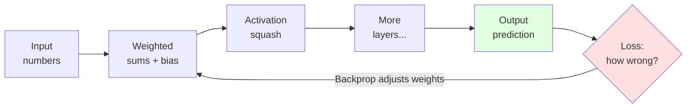

---

### What is a Neural Network?

**Analogy — a factory assembly line.** Raw material (input) passes through stations (layers). Each station reshapes the product a little; by the end you have a finished item (prediction). The network *learns* the best setting for each station by inspecting defects (errors) and adjusting.

| Concept | Real-world parallel |
|---|---|
| **Neuron** | A single worker deciding "yes/no/how much" |
| **Weight** | How much a worker *trusts* each incoming signal |
| **Bias** | A worker's baseline mood (fires easily or reluctantly) |
| **Layer** | One station on the assembly line |
| **Activation** | The nonlinear "gut feeling" that lets the network bend, not just draw straight lines |

> 🔑 Without nonlinear activations, stacking layers collapses into a single straight-line model — no matter how deep.

---

### Perceptron

The **atom** of neural networks: takes inputs, weighs them, adds bias, and fires if the total crosses a threshold.

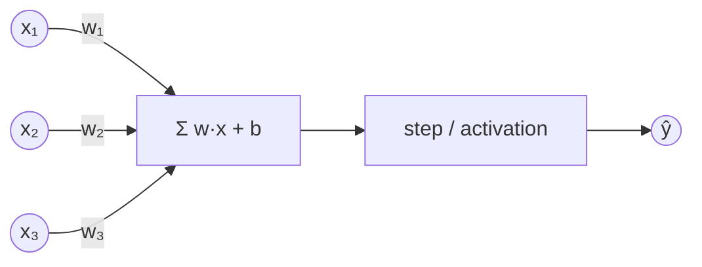

$$\hat{y} = f\!\left(\sum_i w_i x_i + b\right)$$

**🔢 Worked example (dot product):**

$$
\mathbf{x} = \begin{bmatrix} 2 \\ 3 \\ 1 \end{bmatrix},\quad
\mathbf{w} = \begin{bmatrix} 0.5 \\ -1 \\ 2 \end{bmatrix},\quad
b = 1
$$

$$
z = \mathbf{w}\cdot\mathbf{x} + b = (0.5\times2) + (-1\times3) + (2\times1) + 1 = 1 - 3 + 2 + 1 = \mathbf{1}
$$

Since $z = 1 > 0$ → the neuron **fires** ( $\hat{y}=1$ ). Flip one input and the sum can drop below 0 → it stays silent.

**Intuition:** it draws **one straight line** to separate two classes.

> ⚠️ **The famous limit:** a single perceptron *cannot* solve **XOR** — no single line separates it. This dead-end sparked the first "AI winter"… and motivated the MLP.

---

### Multi-Layer Perceptron (MLP)

Stack perceptrons into layers → the network bends space and solves XOR.

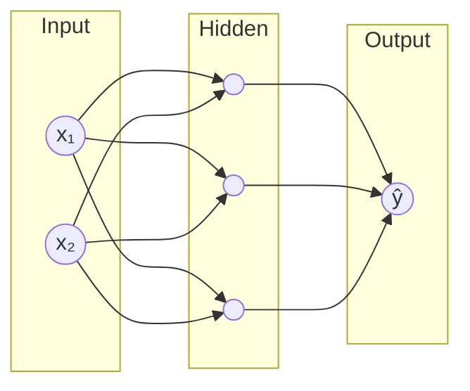

| Layer | Job |
|---|---|
| **Input** | Holds the raw features |
| **Hidden** | Learns intermediate patterns (edges → shapes → objects) |
| **Output** | Produces the final answer |

> 💡 "Deep" learning = simply *many* hidden layers.

---

### Forward Propagation

Data flows **left → right**, layer by layer, producing a prediction.

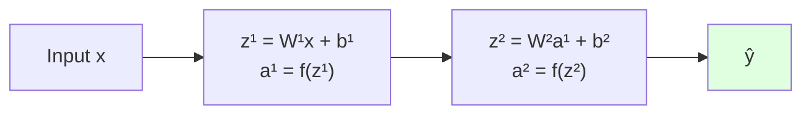

Each layer: **multiply → add bias → activate**, then hand off to the next. That's the entire "inference" path.

**🔢 Worked example (matrix × vector).** A layer with 2 inputs → 3 neurons. The weights form a **3×2 matrix**, one row per neuron:

$$
W^1 = \begin{bmatrix} 1 & 0 \\ 0 & 2 \\ 1 & 1 \end{bmatrix},\quad
\mathbf{x} = \begin{bmatrix} 2 \\ 3 \end{bmatrix},\quad
\mathbf{b}^1 = \begin{bmatrix} 0 \\ 1 \\ -1 \end{bmatrix}
$$

$$
\mathbf{z}^1 = W^1\mathbf{x} + \mathbf{b}^1 =
\begin{bmatrix} 1\cdot2 + 0\cdot3 \\ 0\cdot2 + 2\cdot3 \\ 1\cdot2 + 1\cdot3 \end{bmatrix}
+ \begin{bmatrix} 0 \\ 1 \\ -1 \end{bmatrix}
= \begin{bmatrix} 2 \\ 6 \\ 5 \end{bmatrix}
+ \begin{bmatrix} 0 \\ 1 \\ -1 \end{bmatrix}
= \begin{bmatrix} 2 \\ 7 \\ 4 \end{bmatrix}
$$

Apply ReLU ( $\max(0,z)$ ) → $\mathbf{a}^1 = [2, 7, 4]$. One matrix multiply computes **all three neurons at once** — that's why GPUs love neural nets.

---

### Backpropagation

**Analogy — tracing blame backward.** The output is wrong. Whose fault? Backprop walks **right → left**, assigning each weight its share of the blame (its gradient), so we know which knobs to turn and how much.

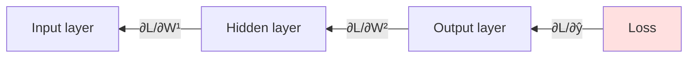

| Pass | Direction | Produces |
|---|---|---|
| **Forward** | → | Prediction + loss |
| **Backward** | ← | Gradient for every weight |

Backprop is just the **chain rule applied efficiently** across the whole network.

---

### Chain Rule

The mathematical engine of backprop: to know how a deep weight affects the final loss, **multiply the local rates of change along the path.**

$$\frac{\partial L}{\partial w} = \frac{\partial L}{\partial a}\cdot\frac{\partial a}{\partial z}\cdot\frac{\partial z}{\partial w}$$

**🔢 Worked example (multiply the ratios).** Say we computed each local rate:

$$
\frac{\partial L}{\partial a} = 0.5,\quad
\frac{\partial a}{\partial z} = 2,\quad
\frac{\partial z}{\partial w} = 3
$$

$$
\frac{\partial L}{\partial w} = 0.5 \times 2 \times 3 = \mathbf{3}
$$

So nudging $w$ up by a tiny $\varepsilon$ raises the loss by about $3\varepsilon$ → gradient descent will push $w$ **down**.

> 🔗 **Analogy — gears meshing.** Turn the first gear a little; the effect on the last gear is the *product* of every gear ratio in between. Backprop chains these ratios from loss back to each weight.

---

### Gradient Descent

**Analogy — descending a foggy hill blindfolded.** You can't see the valley, but you can feel the slope under your feet. Step downhill repeatedly → reach the bottom (minimum loss).

$$w \leftarrow w - \eta \,\frac{\partial L}{\partial w}$$

**🔢 Worked example (one step).** With current weight $w = 5$, gradient $\frac{\partial L}{\partial w} = 3$, learning rate $\eta = 0.1$:

$$
w_{\text{new}} = 5 - 0.1 \times 3 = 5 - 0.3 = \mathbf{4.7}
$$

Repeat this tiny nudge thousands of times → $w$ settles at the value that minimizes loss.

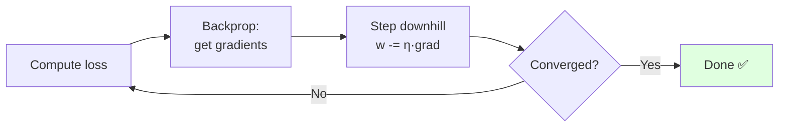

| Learning rate **η** | Effect |
|---|---|
| **Too small** | Crawls — training takes forever |
| **Too large** | Overshoots, bounces, may diverge 💥 |
| **Just right** | Smooth, steady descent |

---

### Loss Functions

The **scorecard** — one number saying how wrong the prediction is. Training = shrinking this number.

| Task | Use | Why |
|---|---|---|
| **Regression** (predict a number) | **MSE** | Penalizes large numeric gaps |
| **Classification** (predict a class) | **Cross-Entropy** | Penalizes confident wrong probabilities |

#### MSE

**Mean Squared Error** — average of squared gaps between prediction and truth.

$$\text{MSE} = \frac{1}{n}\sum_{i}(y_i - \hat{y}_i)^2$$

**🔢 Worked example.** True $\mathbf{y} = [3, 5, 2]$, predicted $\hat{\mathbf{y}} = [2.5, 5, 4]$:

$$
\text{MSE} = \frac{(3-2.5)^2 + (5-5)^2 + (2-4)^2}{3}
= \frac{0.25 + 0 + 4}{3} = \frac{4.25}{3} \approx \mathbf{1.42}
$$

Notice the third prediction (off by 2) contributes **4** — far more than the first (off by 0.5 → just 0.25).

> 📏 Squaring means **big errors hurt disproportionately** — the model prioritizes fixing large mistakes. (Sensitive to outliers.)

#### Cross-Entropy

Measures the "surprise" between predicted probabilities and the true label.

$$\text{CE} = -\sum_i y_i \log(\hat{y}_i)$$

**🔢 Worked example.** 3 classes, true label = class 2 → one-hot $\mathbf{y} = [0, 1, 0]$.

| Case | Predicted $\hat{\mathbf{y}}$ | Loss $= -\log(\hat{y}_{\text{true}})$ |
|---|---|---|
| **Confident & right** | $[0.1, 0.8, 0.1]$ | $-\log(0.8) \approx \mathbf{0.22}$ ✅ |
| **Unsure** | $[0.3, 0.4, 0.3]$ | $-\log(0.4) \approx 0.92$ |
| **Confident & wrong** | $[0.8, 0.1, 0.1]$ | $-\log(0.1) \approx \mathbf{2.30}$ 💥 |

Only the true class's probability matters (the zeros in $\mathbf{y}$ cancel the rest).

> 😱 Being **confident *and* wrong** (predicting 0.99 for the wrong class) is punished severely — driving the model toward well-calibrated probabilities.

---

### Weight Initialization

**Why it matters:** start the knobs badly and signals either **vanish** (shrink to 0) or **explode** (blow up) as they pass through layers — before learning even begins.

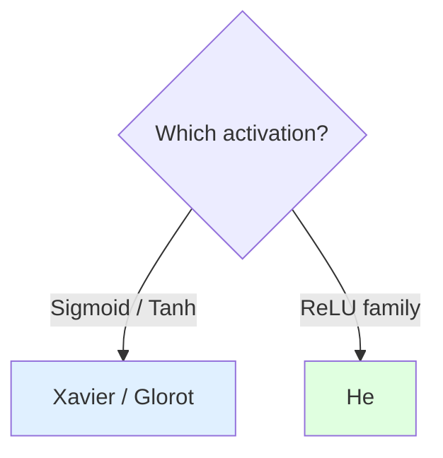

#### Xavier / Glorot Initialization

Balances variance for **symmetric** activations (sigmoid, tanh) by scaling to *both* fan-in and fan-out.

$$\text{Var}(W) = \frac{2}{n_{in}+n_{out}}$$

#### He Initialization

Tuned for **ReLU**, which zeros out half its inputs — so it uses a larger scale to keep signal alive.

$$\text{Var}(W) = \frac{2}{n_{in}}$$

| | Best for | Scale |
|---|---|---|
| **Xavier/Glorot** | sigmoid, tanh | fan-in **+** fan-out |
| **He** | ReLU, Leaky ReLU, GELU | fan-in only (larger) |

---

### Bias

The **adjustable baseline** added before activation. It lets a neuron fire even when all inputs are zero — shifting the decision boundary left/right.

> 🎚️ **Analogy — a thermostat offset.** Weights decide *how strongly* temperature affects the heater; bias sets the *baseline* temperature at which it kicks in. Without bias, every boundary is forced through the origin.

**🔢 Worked example (bias shifts the decision).** Same input $\mathbf{x}=[2,3]$, weights $\mathbf{w}=[1,-1]$, so $\mathbf{w}\cdot\mathbf{x} = 2 - 3 = -1$:

| Bias $b$ | $z = \mathbf{w}\cdot\mathbf{x} + b$ | Fires? ( $z>0$ ) |
|---|---|---|
| $0$ | $-1$ | ❌ No |
| $+2$ | $+1$ | ✅ Yes |

Same inputs, same weights — **bias alone** flipped the decision.

---

### Universal Approximation Theorem

> **The big promise:** a network with **just one hidden layer** and enough neurons can approximate *any* continuous function — to arbitrary accuracy.

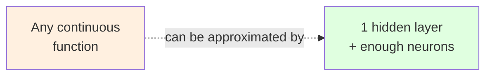

**The fine print:**

| Theorem says | Reality adds |
|---|---|
| A solution *exists* | Doesn't tell you *how to find it* |
| One wide layer suffices | **Deep** networks reach it far more efficiently (fewer neurons) |
| Arbitrary accuracy possible | Needs the right data, training & optimization |

> 🧠 **Takeaway:** existence ≠ trainability. Depth is a practical shortcut, not a theoretical necessity.

---

## 2. Activation Functions & Optimization

### Activation Functions

> **Why they exist:** without a nonlinear "squash," stacking layers just makes one big linear model. Activations are the **bend** that lets networks learn curves, not just straight lines.

**Analogy — a dimmer switch, not a light switch.** A raw weighted sum can be any number. The activation decides *how much* signal passes through — off, partial, or full.

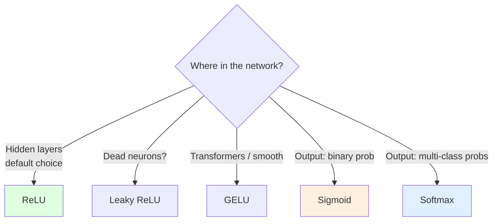

**Cheat-sheet:**

| Function | Range | Shape | Use it for |
|---|---|---|---|
| **Sigmoid** | (0, 1) | S-curve | Binary output probability |
| **Tanh** | (−1, 1) | S-curve, centered | Hidden layers (old RNNs) |
| **ReLU** | [0, ∞) | Hinge | **Default** hidden layers |
| **Leaky ReLU** | (−∞, ∞) | Hinge w/ leak | Fix "dead" ReLU neurons |
| **GELU** | ≈(−0.17, ∞) | Smooth hinge | Transformers / LLMs |
| **Softmax** | (0, 1), sums to 1 | Normalizer | Multi-class output |

---

#### Sigmoid

Squashes any number into **(0, 1)** — perfect for "probability of yes."

$$\sigma(z) = \frac{1}{1 + e^{-z}}$$

**🔢 Quick values:** $\sigma(0)=0.5$, $\sigma(2)\approx0.88$, $\sigma(-2)\approx0.12$.

```
 1 ┤          ╭─────
   │        ╭─╯
0.5┤─ ─ ─ ╭╯
   │    ╭─╯
 0 ┤────╯
   └──────────────
   -6    0     +6
```

> ⚠️ **Vanishing gradient:** for large $|z|$ the curve flattens → slope ≈ 0 → learning stalls. Rarely used in hidden layers today.

---

#### Tanh

Sigmoid's **zero-centered** cousin — outputs **(−1, 1)**, so signals can be negative.

$$\tanh(z) = \frac{e^z - e^{-z}}{e^z + e^{-z}}$$

**🔢 Quick values:** $\tanh(0)=0$, $\tanh(1)\approx0.76$, $\tanh(-1)\approx-0.76$.

| vs Sigmoid | Tanh advantage |
|---|---|
| Centered at 0 | Balanced +/− signals → faster convergence |
| Stronger gradients | Steeper slope near 0 |

> ⚠️ Still saturates at the tails → same vanishing-gradient problem as sigmoid.

---

#### ReLU

**Re**ctified **L**inear **U**nit — the workhorse. Dead simple: negatives → 0, positives pass through unchanged.

$$\text{ReLU}(z) = \max(0, z)$$

```
   │      ╱
   │    ╱
   │  ╱
───┼╱──────────
   0
```

**🔢 Worked example (vector):**

$$\text{ReLU}\!\begin{bmatrix} -3 \\ 0 \\ 2 \\ 5 \end{bmatrix} = \begin{bmatrix} 0 \\ 0 \\ 2 \\ 5 \end{bmatrix}$$

| ✅ Why loved | ❌ Watch out |
|---|---|
| No saturation for $z>0$ (gradient = 1) | **Dead ReLU:** stuck at 0 → gradient 0 forever |
| Cheap: just a comparison | Not zero-centered |
| Sparse activations (many exact 0s) | |

---

#### Leaky ReLU

Fixes **dead ReLU** by letting a small trickle through for negatives instead of a hard 0.

$$\text{LeakyReLU}(z) = \max(\alpha z,\, z),\quad \alpha \approx 0.01$$

**🔢 Example:** with $\alpha=0.01$, input $-3 \rightarrow -0.03$ (a tiny slope keeps the gradient alive).

```
   │      ╱
   │    ╱
───┼──╱──────────
  ╱│ 0     ← small slope, not flat
```

> 💡 The nonzero slope on the left means the neuron can always **recover** — no permanent death.

---

#### GELU

**G**aussian **E**rror **L**inear **U**nit — a smooth, curvy ReLU used in Transformers (BERT, GPT).

$$\text{GELU}(z) = z \cdot \Phi(z)$$

where $\Phi(z)$ is the probability a standard normal is below $z$ — so the input is scaled by "how likely it should pass."

```
   │      ╱
   │    ╱
───┼──╭╯──────────   ← smooth dip below 0, then rises
   0
```

| ReLU | GELU |
|---|---|
| Hard cutoff at 0 | Smooth, differentiable everywhere |
| Binary gate (on/off) | Probabilistic gate (soft) |
| CNNs, general nets | **Transformers / LLMs** |

---

#### Softmax

Turns a vector of raw scores (**logits**) into a **probability distribution** — all values in (0, 1), summing to **1**.

$$\text{softmax}(z_i) = \frac{e^{z_i}}{\sum_j e^{z_j}}$$

**🔢 Worked example.** Logits $\mathbf{z} = [2, 1, 0]$:

| Step | Class A | Class B | Class C |
|---|---|---|---|
| $e^{z_i}$ | $e^2 = 7.39$ | $e^1 = 2.72$ | $e^0 = 1.00$ |
| ÷ sum (11.11) | **0.67** | **0.24** | **0.09** |

→ Probabilities $[0.67, 0.24, 0.09]$ sum to **1.0**. The biggest logit gets the lion's share (exponent **amplifies** gaps).

> 🔑 **Softmax vs Sigmoid:** sigmoid = independent yes/no per output; softmax = "pick one of many," outputs **compete** and sum to 1.

---

### Optimization

> **The goal:** find the weights that minimize loss — *fast* and *reliably*. Optimizers are the **strategy** for stepping downhill (gradient descent is the baseline; the rest are upgrades).

**Analogy — rolling a ball down a valley.** Plain SGD is a ball that only knows the *current* slope. Add **momentum** and it builds speed. Add **adaptive rates** (AdaGrad/RMSProp) and it slows on steep, jittery paths. **Adam** does both at once.

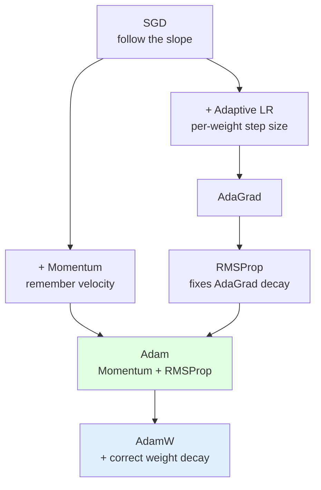

**Which to use?**

| Situation | Pick |
|---|---|
| Default, "just works" | **Adam / AdamW** |
| Training Transformers / LLMs | **AdamW** |
| Best final accuracy (CNNs, with tuning) | **SGD + Momentum** |
| Sparse features (NLP, embeddings) | **AdaGrad** family |

---

#### Batch, Mini-Batch & SGD

**How many examples do you look at before taking one step?** That's the whole distinction.

| Type | Examples per step | Trade-off |
|---|---|---|
| **Batch GD** | *All* data | Smooth but slow, memory-heavy |
| **Mini-Batch** | 32 – 512 | ⭐ Sweet spot — fast + stable |
| **SGD** (pure) | 1 | Noisy, but escapes bad spots |

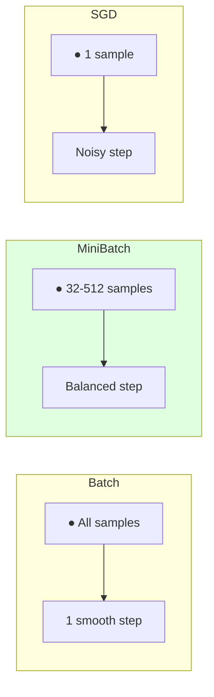

$$w \leftarrow w - \eta \cdot \nabla L_{\text{batch}}$$

> 💡 "SGD" in practice almost always means **mini-batch** SGD. The noise from small batches is a *feature* — it helps jump out of poor local minima.

---

#### Momentum

**Analogy — a heavy ball vs a feather.** A feather stops the instant the slope flattens; a rolling ball keeps going, powering through small bumps and speeding up on long descents.

Accumulates a **velocity** from past gradients instead of reacting only to the current one:

$$
v \leftarrow \beta v + (1-\beta)\,\nabla L \qquad
w \leftarrow w - \eta\, v
$$

**🔢 Intuition ($\beta = 0.9$):** if gradients keep pointing the same way, velocity grows ≈ **10×** larger than a single step → you accelerate. If they flip-flop, they cancel → you don't oscillate wildly.

| Without momentum | With momentum |
|---|---|
| Zig-zags across valleys | Smooths the path, builds speed |
| Slow in flat regions | Coasts through plateaus |

---

#### AdaGrad

**Ada**ptive **Grad**ient — gives each weight its **own** learning rate. Rarely-updated weights get big steps; frequently-updated ones get small steps.

$$w \leftarrow w - \frac{\eta}{\sqrt{G} + \epsilon}\,\nabla L$$

where $G$ = running sum of *squared* past gradients.

> ✅ **Great for sparse data** (e.g. rare words in NLP).
> ⚠️ **Fatal flaw:** $G$ only grows → the step size shrinks toward **0** → learning eventually **stops**.

---

#### RMSProp

Fixes AdaGrad's decay problem: instead of summing *all* past gradients forever, it keeps a **moving average** (recent gradients matter more).

$$
G \leftarrow \gamma G + (1-\gamma)(\nabla L)^2 \qquad
w \leftarrow w - \frac{\eta}{\sqrt{G}+\epsilon}\,\nabla L
$$

| AdaGrad | RMSProp |
|---|---|
| Sums **all** past gradients | **Decaying** average (forgets old) |
| Learning rate → 0, stalls | Stays alive indefinitely |

> 💡 The single word swap — **sum → moving average** — is the entire fix.

---

#### Adam

**Ada**ptive **M**oment estimation — the most popular optimizer. Combines the two big ideas:

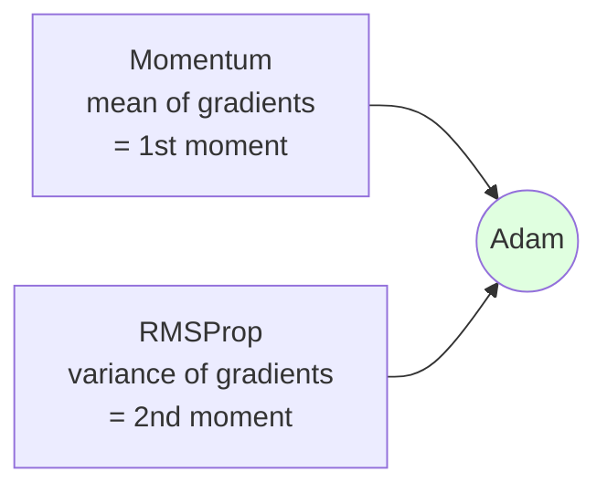

$$
m \leftarrow \beta_1 m + (1-\beta_1)\nabla L \quad\text{(direction)}
$$
$$
v \leftarrow \beta_2 v + (1-\beta_2)(\nabla L)^2 \quad\text{(scale)}
$$
$$
w \leftarrow w - \eta\,\frac{\hat{m}}{\sqrt{\hat{v}}+\epsilon}
$$

| Defaults | $\beta_1=0.9$, $\beta_2=0.999$, $\epsilon=10^{-8}$ |
|---|---|

> 🔑 **Why the default choice:** fast convergence, little tuning, robust across tasks. When unsure — use Adam.

---

#### AdamW

Adam with **decoupled weight decay** — the modern standard for Transformers/LLMs.

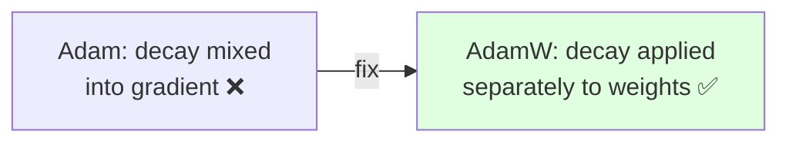

$$w \leftarrow w - \eta\left(\frac{\hat{m}}{\sqrt{\hat{v}}+\epsilon} + \lambda w\right)$$

| Adam | AdamW |
|---|---|
| Weight decay tangled with adaptive scaling | Decay applied **cleanly**, separate from gradient |
| Weaker regularization | Better generalization → **standard for LLMs** |

---

#### Learning Rate Scheduling

**Analogy — parking a car.** Approach fast (big LR), then ease off the gas as you near the spot (small LR) so you don't overshoot.

The learning rate **changes over training** instead of staying fixed:

```
LR
 │╲          ← warmup ramps up
 │ ╲___
 │     ╲╲___      ← then decays
 │         ╲╲╲____
 └────────────────► steps
```

| Schedule | Behavior | Common use |
|---|---|---|
| **Step decay** | Drop LR ×0.1 every N epochs | Classic CNNs |
| **Cosine** | Smooth wave down to ~0 | Modern default |
| **Warmup** | Start tiny, ramp up, then decay | ⭐ **Transformers/LLMs** |

> 💡 **Warmup matters** in Transformers: jumping straight to a high LR early (when weights are random) destabilizes training — so ramp up gently first.

---

## 3. Training Challenges & Regularization

> **30-second mental model:** Training a deep network is like tuning a delicate instrument — too little signal (vanishing gradient), too much (exploding), wrong memory layout (dead neurons), or memorising the sheet music instead of learning to play (overfitting). This section is the **troubleshooting guide**.

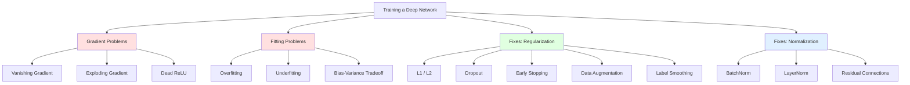

---

### Challenges

#### Vanishing Gradient

> **One-liner:** gradients shrink exponentially as they travel backward through deep layers — early layers stop learning.

**Analogy — a game of telephone 📞.** Whisper a number, multiply it by 0.5 at each person → by person 20 the number is ~0. That's backprop through sigmoid/tanh layers.

$$\frac{\partial L}{\partial w^{(1)}} = \frac{\partial L}{\partial a^{(n)}} \cdot \prod_{i=1}^{n} \frac{\partial a^{(i)}}{\partial a^{(i-1)}}$$

The chain rule **multiplies** gradients across layers. If each factor < 1 (as with saturated sigmoid/tanh) the product collapses to ≈ 0.

**🔢 Intuition.** Gradient 1.0 at output, multiplied through 10 layers each shrinking by 0.5:

$$1.0 \times 0.5^{10} = 0.001$$

Early-layer weight receives gradient ~0 → never updates.

| Symptom | Cause | Fix |
|---|---|---|
| Early layers don't learn | Repeated multiplication < 1 | **ReLU** (gradient = 1 for z>0) |
| Very slow training | Sigmoid/tanh saturation | **BatchNorm**, **ResNets** |
| Loss plateaus early | No signal reaching input layers | **Better initialisation** (He/Xavier) |

---

#### Exploding Gradient

> **One-liner:** the opposite problem — gradients grow exponentially, causing weight updates so large the model diverges.

**Analogy — compounding interest gone wrong 💸.** Multiply a value by 2 at each of 10 layers: $1.0 \times 2^{10} = 1024$. Weights jump by thousands → NaN loss.

| Symptom | Fix |
|---|---|
| Loss suddenly → NaN | **Gradient clipping** (cap ‖g‖ at threshold) |
| Weights blow up | **Lower learning rate** |
| Common in deep RNNs | **LSTM/GRU** gating |

**Gradient clipping:**

$$\mathbf{g} \leftarrow \mathbf{g} \cdot \frac{\text{clip\_norm}}{\max(\|\mathbf{g}\|,\;\text{clip\_norm})}$$

**🔢 Example.** Gradient norm = 10, clip threshold = 1.0 → scale by 0.1 → norm reduced to 1.

> 💡 Vanishing = too little signal (multiply < 1). Exploding = too much signal (multiply > 1). Same root cause, opposite disasters.

---

#### Dead ReLU

> **One-liner:** a ReLU neuron permanently stuck outputting 0 — its gradient is always 0, so it never recovers.

**Analogy — a burnt-out lightbulb 💡→❌.** If the pre-activation $z$ is always negative (e.g. after a large weight update sends the bias very negative), $\text{ReLU}(z)=0$ forever. The gradient through it is 0 → backprop never fixes it → it's dead.

```
Input → [z = -5] → ReLU = 0 → gradient = 0 → weight never updates → z stays -5 ♾️
```

| Cause | Fix |
|---|---|
| Large LR pushes bias very negative | Lower learning rate |
| Bad initialisation | He initialisation |
| Permanent zero output | **Leaky ReLU / ELU / GELU** (non-zero for z<0) |

> ⚠️ Dead ReLU neurons are invisible during training — loss looks fine but capacity is wasted. Check activation histograms.

---

#### Overfitting

> **One-liner:** the model memorises the training data instead of learning the pattern — it aces training but fails on new data.

**Analogy — cramming for an exam 📚.** You memorise every practice question verbatim. On the real exam the questions are slightly different → you fail.

```
Training loss  ↘↘↘ (low)
Validation loss ↘ then ↗↗  ← the gap = overfitting
```

| Symptom | Signal |
|---|---|
| Train loss << val loss | Classic overfit gap |
| Perfect training accuracy, poor test | Memorisation |
| Model too large for dataset | Too many parameters |

**Fixes:** Dropout · L1/L2 · Early Stopping · Data Augmentation · Label Smoothing (all detailed below).

---

#### Underfitting

> **One-liner:** the model is too simple (or under-trained) to capture the true pattern — it fails on both train and test.

**Analogy — a student who barely studied 😴.** Scores poorly everywhere. More study (more training, bigger model) is the fix.

| Symptom | Fix |
|---|---|
| High train loss AND high val loss | More capacity, more training |
| Loss plateaued too early | Higher LR, train longer |
| Model too shallow | Add layers / units |

---

#### Bias-Variance Tradeoff

> **One-liner:** bias = error from being too simple (underfits); variance = error from being too sensitive to training noise (overfits). You can't minimise both simultaneously — you trade between them.

```
Total error = Bias² + Variance + Irreducible noise
```

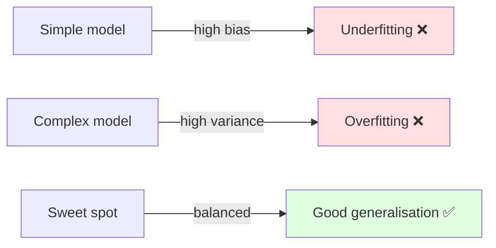

| | Bias | Variance | Train error | Val error |
|---|---|---|---|---|
| Underfitting | High | Low | High | High |
| **Good fit** | Medium | Medium | Low | Low |
| Overfitting | Low | High | Very low | High |

> 💡 The bias-variance tradeoff is **why regularisation works**: it increases bias slightly (simplifies the model) in exchange for a much larger reduction in variance — net error goes down.

---

### Regularization

> **Goal:** reduce overfitting by preventing the model from being too complex or too confident. Add a controlled constraint on what the model can learn.

**How to choose:**

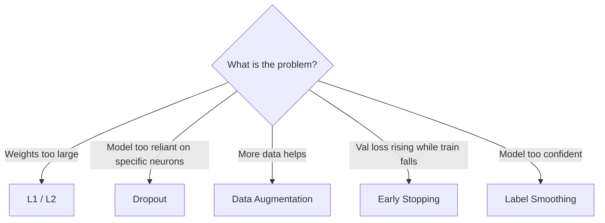

---

#### L1 vs L2 (Weight Decay)

Add a **penalty** on weights to the loss function — pushes weights toward 0, discouraging over-reliance on any single feature.

| | L1 (Lasso) | L2 (Ridge / Weight Decay) |
|---|---|---|
| Penalty term | $\lambda \sum |w|$ | $\frac{\lambda}{2}\sum w^2$ |
| Effect on weights | Drives many weights to **exactly 0** (sparse) | Shrinks all weights smoothly (dense) |
| Best for | Feature selection, sparse models | General regularisation — **default** |
| Gradient | $\lambda \cdot \text{sign}(w)$ | $\lambda w$ |

**🔢 Example (L2 update).** $w=0.8$, gradient $=0.2$, $\eta=0.1$, $\lambda=0.01$:

$$w_{\text{new}} = 0.8 - 0.1 \times (0.2 + 0.01 \times 0.8) = 0.8 - 0.0208 = 0.779$$

The weight shrinks a little more than without regularisation (it would be 0.78). Repeated every step, large weights are continuously pulled toward 0.

> 💡 **AdamW** separates weight decay from the adaptive gradient update — the modern default for Transformers.

---

#### Dropout

Randomly **zero out** a fraction $p$ of neurons during each training forward pass — the network can never rely on any single neuron.

**Analogy — a sports team with random absences 🏃.** If any player might be absent on game day, every player learns to cover multiple roles. The full team at test time is an implicit ensemble of all the sub-teams seen in training.

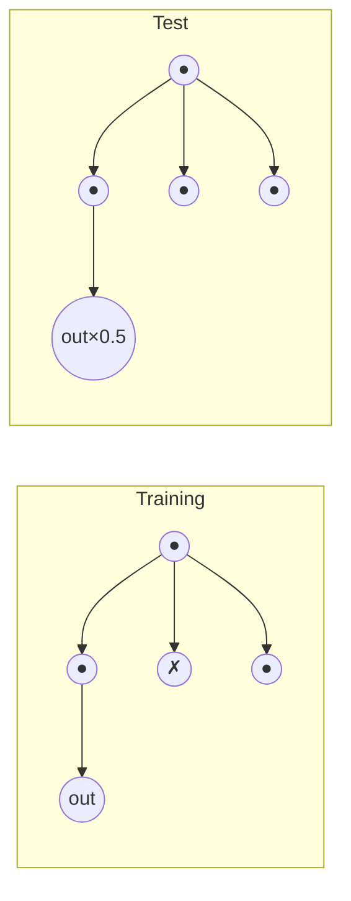

| Training | Test |
|---|---|
| Each neuron dropped with probability $p$ | All neurons active |
| Forces redundancy | Outputs scaled by $(1-p)$ to match expected sum |

**🔢 Example.** Layer outputs $[2.0, 3.0, 1.0]$, $p=0.5$, mask $=[1, 0, 1]$:

$$\text{dropped} = [2.0, 0.0, 1.0]$$

At test time: $[2.0, 3.0, 1.0] \times 0.5 = [1.0, 1.5, 0.5]$ (rescaled to keep same expected activation).

> ⚠️ **Gotcha:** at test/inference time dropout is **disabled** and outputs are rescaled. Forgetting to turn it off is a common source of poor inference performance.

---

#### Early Stopping

Stop training when **validation loss stops improving** — don't wait for training loss to bottom out.

```
Epoch:    1   5   10  15  20  25  30
Train ▼:  2.0 1.2 0.7 0.4 0.2 0.1 0.05
Val   ▽:  2.1 1.3 0.8 0.9 1.1 1.3 1.6
                    ↑
              Stop here — best val loss
```

**Patience** = how many epochs without improvement before stopping (e.g. patience=5 → stop after 5 consecutive non-improving epochs).

| Benefit | Detail |
|---|---|
| Free regularisation | No extra hyperparameter beyond patience |
| Save compute | Don't waste epochs on overfitting |
| Pairs with checkpointing | Save best-val-loss model weights; restore at end |

---

#### Data Augmentation

**Artificially expand the training set** by applying label-preserving transformations — the model sees more variation without collecting new data.

| Domain | Common augmentations |
|---|---|
| **Images** | Flip, crop, rotate, colour jitter, cutout |
| **Text** | Synonym swap, back-translation, random deletion |
| **Audio** | Time stretch, pitch shift, add noise |
| **Tabular** | Mixup (interpolate two examples) |

**Analogy — practising free throws from slightly different spots 🏀.** The hoop is always the same, but varying your position builds more robust aim than always standing in the exact same spot.

> 💡 Data augmentation is one of the highest-ROI regularisation techniques — it's essentially free extra data.

---

#### Label Smoothing

Instead of training with hard one-hot labels $[0, 0, 1, 0]$, use **soft targets** that spread a small probability $\varepsilon$ over all classes:

$$y_{\text{smooth}} = (1-\varepsilon)\,y_{\text{one-hot}} + \frac{\varepsilon}{K}$$

**🔢 Example.** 4 classes, true class = 3, $\varepsilon=0.1$:

$$y = [0,0,1,0] \;\rightarrow\; [0.025,\; 0.025,\; 0.925,\; 0.025]$$

| Without label smoothing | With label smoothing |
|---|---|
| Model trained to push logit → +∞ for true class | Model penalised for being overconfident |
| Overconfident softmax probabilities | Better calibrated probabilities |
| More prone to adversarial examples | Slight accuracy improvement on many tasks |

> 💡 Used in many state-of-the-art image and NLP models. The constant $\varepsilon=0.1$ is a common default.

---

### Normalization

> **Goal:** stabilise activations *during* the forward pass so that gradients flow cleanly and training is faster and more stable. Think of it as keeping the "signal strength" consistent across layers.

**Analogy — a volume normaliser on an audio track 🎚️.** Without it, some channels scream and others whisper — the amplifier (next layer) can't process either well. Normalisation brings everything to a consistent level.

---

#### BatchNorm

Normalises each **feature** across the **batch** dimension, then rescales with learned $\gamma, \beta$.

$$\hat{x} = \frac{x - \mu_{\text{batch}}}{\sigma_{\text{batch}} + \epsilon}, \qquad y = \gamma \hat{x} + \beta$$

**🔢 Example.** Batch activations for one feature: $[2, 4, 6, 8]$.

$$\mu = 5,\quad \sigma = \sqrt{5} \approx 2.24$$
$$\hat{x} = \left[\frac{2-5}{2.24},\;\frac{4-5}{2.24},\;\frac{6-5}{2.24},\;\frac{8-5}{2.24}\right] \approx [-1.34,\;-0.45,\;0.45,\;1.34]$$

Then $\gamma$ and $\beta$ (learned) rescale/shift: the network can undo the normalisation if needed.

| ✅ Benefits | ⚠️ Limitations |
|---|---|
| Faster training, higher LR possible | Depends on batch — fails with batch size 1 |
| Acts as mild regulariser | Statistics differ: train (batch) vs test (running avg) |
| Reduces sensitivity to initialisation | Wrong in RNNs / variable-length sequences |

> ⚠️ **Gotcha:** at inference BatchNorm uses the **running mean/variance** computed during training (not the current mini-batch). Forgetting to call `model.eval()` gives wrong results.

---

#### LayerNorm

Normalises across the **feature** dimension for each sample individually — no dependence on batch size.

$$\hat{x}_i = \frac{x_i - \mu_{\text{layer}}}{\sigma_{\text{layer}} + \epsilon}$$

**🔢 Example.** One sample's activations: $[2, 4, 6, 8]$ (same numbers as above, but now treated as features of ONE example).

$$\mu = 5,\quad \sigma \approx 2.24 \quad \Rightarrow \quad \hat{x} \approx [-1.34,\;-0.45,\;0.45,\;1.34]$$

| | BatchNorm | LayerNorm |
|---|---|---|
| Normalise across | Batch (per feature) | Features (per sample) |
| Batch size sensitive? | ✅ Yes | ❌ No |
| Works for RNNs / Transformers? | ❌ Poorly | ✅ Yes |
| Standard in | CNNs | **Transformers / LLMs** |

> 💡 LayerNorm replaced BatchNorm in Transformers precisely because sequences have variable lengths and batch size 1 is common.

---

#### Residual Connections

**Skip connections** that add the input of a block directly to its output — the block only needs to learn the **residual** (the difference), not the full transformation.

$$y = F(x) + x$$

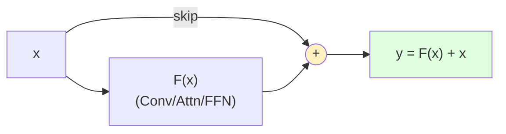

**Why this is a big deal:**

| Without residuals | With residuals |
|---|---|
| Gradient must survive every layer multiply | Skip path provides gradient **highway** |
| Deep networks degrade (train error rises!) | Training error keeps falling with depth |
| Practical limit ~10-20 layers | ResNet-152, Transformers: 100s of layers |

**🔢 Intuition.** If $F(x)$ learns something close to zero (the block does almost nothing), then $y \approx x$ — the layer becomes an identity. Deep networks can therefore "decide" not to transform at layers where it isn't helpful, making training much more robust.

> 🔑 Residuals fix degradation (NOT vanishing gradient directly — that's BatchNorm/initialisation). The insight: it's easier to learn **zero** than to learn an identity mapping through a stack of nonlinearities.

---

## 4. Convolutional Neural Networks (CNNs)

### CNN Concepts

#### Convolution

#### Kernel / Filter

#### Padding

#### Stride

#### Pooling

#### Receptive Field

#### Depthwise Separable Convolution

#### Dilated Convolution

### CNN Architectures

#### ResNet

#### EfficientNet

---

## 5. Sequence Models

> **30-second model:** Sequence models process data where **order carries meaning** — a sentence, an audio clip, a stock chart. The trick: keep a running **memory (hidden state)** that summarizes "everything so far," and update it as each new element arrives. Change the order → change the meaning. `"dog bites man"` ≠ `"man bites dog"`.

**Analogy — reading a sentence word by word 📖:** You don't re-read the whole page for every word. You hold a mental summary of what you've read, and each new word *updates* that summary. That running summary is the hidden state.

🔑 **Key insight:** A plain feed-forward net sees each input independently. A sequence model **feeds its own hidden state back in** — giving it a memory of the past. (In generation, the previous *output* token is also fed in, but the recurrent memory itself is the hidden state.)

---

### Why the family grew (evolution)

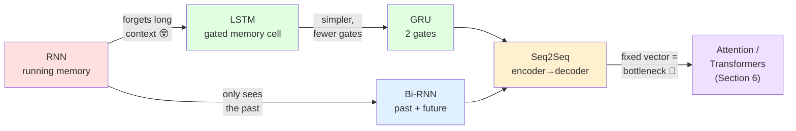

**Read it as a chain of fixes:**

| Problem | Fix that arose |
| --- | --- |
| RNN's memory fades over long sequences (vanishing gradient) | **LSTM/GRU** add *gates* that decide what to keep, forget, and output |
| Only one direction — can't use words *after* the current one | **Bi-RNN** runs two passes (left→right + right→left) |
| Input and output are different-length sequences (translate 5 words → 7) | **Seq2Seq** encodes the whole input into a state, then decodes a new sequence |
| Cramming everything into ONE fixed vector loses detail | **Attention** (→ Section 6) lets the decoder look back at *all* inputs |

**Takeaway:** Each model is one fix layered on the last — memory that fades → gated memory → both directions → variable-length I/O → attention.

---

### When to reach for what

| Model | Best for | Key limitation |
| --- | --- | --- |
| **RNN** | Short sequences, teaching the core idea | Forgets long-range context |
| **LSTM** | Long dependencies (long docs, time-series) | Heavier, slower to train |
| **GRU** | Same as LSTM, smaller data/compute | Slightly less expressive than LSTM |
| **Bi-RNN** | Full sequence known up front (tagging, NER) | ❌ Not for real-time / streaming |
| **Seq2Seq** | Input seq → output seq (translation, summarization) | Fixed-vector bottleneck (fixed by attention) |

💡 **Rule of thumb:** *Sequence in → same-position labels out?* Use RNN/LSTM/GRU (Bi- if the full input is available). *Sequence in → new sequence out?* Use Seq2Seq. *Need long-range focus?* You've arrived at Attention.

**Takeaway:** Every model below is one answer to the same question — *how do we remember the right parts of the past (and future)?*

---

### RNN

> **One-line intuition:** A network that reads a sequence one step at a time, keeping a running "memory" of everything it has seen so far.

**Analogy — a running scoreboard 📊:** You don't replay every past play to know the score — you keep one running tally and update it after each play. The hidden state $h_t$ *is* that tally: the whole game so far, compressed into one small set of numbers and carried forward.

---

#### The recurrent loop 🔑

An RNN has a loop: the hidden state feeds back into itself at the next timestep. That feedback is the "memory."

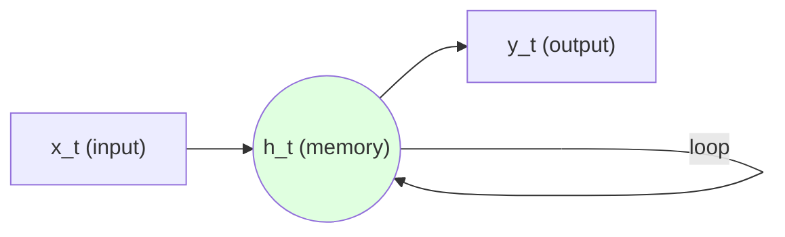

- `x_t` = input at step *t* (e.g. the current word)
- `h_t` = hidden state = summary of steps `1..t`
- The loop edge carries `h_{t-1}` forward into step *t*.

---

#### Unrolled through time

The loop is easier to reason about when "unrolled" — one copy of the cell per timestep, chained left to right.

```mermaid
flowchart LR
  x1["x1"] --> h1(("h1"))
  x2["x2"] --> h2(("h2"))
  x3["x3"] --> h3(("h3"))
  h0(("h0")) --> h1
  h1 -->|"W_h"| h2
  h2 -->|"W_h"| h3
  h1 --> y1["y1"]
  h2 --> y2["y2"]
  h3 --> y3["y3"]
  style h1 fill:#e0ffe0
  style h2 fill:#e0ffe0
  style h3 fill:#e0ffe0
```

💡 It *looks* like a deep network, but every step reuses the **same** weights.

---

#### The core recurrence

$$h_t = f\left(W_h\, h_{t-1} + W_x\, x_t + b\right)$$

| Symbol | Meaning |
|---|---|
| $h_{t-1}$ | previous memory (what we knew before) |
| $x_t$ | new input this step |
| $W_h, W_x$ | weight matrices (memory vs. input) |
| $b$ | bias |
| $f$ | squashing nonlinearity, usually $\tanh$ |

---

#### Weight SHARING across timesteps 🔑

**Analogy — one rubber stamp, reused on every page.** There is *one* set of parameters $(W_h, W_x, b)$, applied identically at every timestep.

- ✅ Handles **variable-length** sequences (5 words or 500 — same weights).
- ✅ Far fewer parameters than a separate layer per step.
- ✅ A pattern learned at step 2 is recognized at step 200.

---

#### 🔢 Worked example — ONE recurrence step

Tiny scalars, so you can do it in your head:

```
h_{t-1} = [0.5]      x_t = [1.0]
W_h = 0.2   W_x = 0.4   b = 0.1
```

Step 1 — pre-activation:

$$z = W_h h_{t-1} + W_x x_t + b = (0.2)(0.5) + (0.4)(1.0) + 0.1 = 0.6$$

Step 2 — squash with $\tanh$:

$$h_t = \tanh(0.6) \approx 0.537$$

So `h_t = [0.537]` — the new memory, blending old memory (0.5) with the new input (1.0).

---

#### Killer limitations ⚠️

```mermaid
flowchart TB
  A["Long sequence"] --> B["Gradient multiplied<br/>step after step"]
  B --> C["|W| &lt; 1 → shrinks<br/>to 0 (vanishing)"]
  B --> D["|W| &gt; 1 → blows<br/>up (exploding)"]
  C --> E["Forgets distant past<br/>= short memory"]
  D --> F["Unstable / NaN training"]
  style E fill:#ffe0e0
  style F fill:#ffe0e0
```

| Problem | Cause | Effect |
|---|---|---|
| ⚠️ Vanishing gradients | same weight multiplied many times, $<1$ | can't learn **long-range** dependencies → short memory |
| ⚠️ Exploding gradients | same weight multiplied many times, $>1$ | unstable updates, NaNs (mitigated by gradient **clipping**) |
| ⚠️ No parallelism | $h_t$ needs $h_{t-1}$ first | strictly **sequential** → slow to train vs. CNN/Transformer |

**Gotcha:** the vanishing-gradient problem is *why* plain RNNs rarely remember more than a handful of steps back — and exactly what LSTM/GRU gates were invented to fix.

---

**Takeaway:** An RNN is a loop that carries a hidden-state "memory" forward with **shared weights** — elegant for sequences, but vanishing gradients give it a short memory and its sequential nature makes it slow.

---

### Bidirectional RNN

> **One-line intuition:** Read the sequence *forward* AND *backward*, then glue the two readings together — so every position sees the WHOLE sentence, not just the past.

**Analogy — the ambiguous word 🏦:** To know what "bank" means, you need the words *before* AND *after* it:

| Context | "bank" means |
|---|---|
| "river **bank**" | 🌊 land beside water |
| "**bank** account" | 💰 financial institution |

A plain (unidirectional) RNN reading left-to-right hits "bank" *before* seeing "account" — it has to guess. A **Bi-RNN** also reads right-to-left, so at "bank" it already knows what follows.

---

#### 🔑 The idea: two RNNs, opposite directions

- A **forward** RNN → processes $x_1, x_2, \dots, x_T$ (left → right)
- A **backward** RNN ← processes $x_T, \dots, x_2, x_1$ (right → left)
- At each position $t$, **concatenate** both hidden states:

$$h_t = [\overrightarrow{h_t} \; ; \; \overleftarrow{h_t}]$$

```mermaid
flowchart LR
  x1["x1<br/>the"] --> x2["x2<br/>river"] --> x3["x3<br/>bank"]
  subgraph FWD["Forward →"]
    f1(("→h1")) --> f2(("→h2")) --> f3(("→h3"))
  end
  subgraph BWD["Backward ←"]
    b3(("←h3")) --> b2(("←h2")) --> b1(("←h1"))
  end
  x1 --> f1
  x2 --> f2
  x3 --> f3
  x1 --> b1
  x2 --> b2
  x3 --> b3
  f2 --> y2["y2 = [→h2 ; ←h2]"]
  b2 --> y2
  style y2 fill:#e0ffe0
```

*Output at each position = forward state (past) glued to backward state (future).*

---

#### 🔢 Tiny worked example (concat)

Suppose at position $t$ the two RNNs each output a 2-dim hidden state:

$$\overrightarrow{h_t} = [0.2,\; 0.9], \qquad \overleftarrow{h_t} = [0.5,\; 0.1]$$

Concatenate → the Bi-RNN output for that word is **4-dim**:

$$h_t = [\,0.2,\; 0.9,\; 0.5,\; 0.1\,]$$

💡 Note the output width **doubles** (2 → 4). Downstream layers must expect $2\times$ the hidden size.

---

#### ✅ When it helps vs ❌ when you can't use it

| ✅ Works great (offline / full sequence known) | ❌ Cannot be used (future not available yet) |
|---|---|
| NER / POS tagging (need right context) | Real-time / streaming input |
| Machine-translation **encoder** | Autoregressive **generation** (predict next token) |
| Speech-to-text on a recorded clip | Live decoding as words arrive |
| Sentiment / classification of full text | Any task where $x_{t+1}$ doesn't exist yet |

⚠️ **Pitfall:** The whole trick is seeing the future. In streaming or generation you *don't have* the future tokens — the backward pass is impossible. Bi-RNNs are strictly for cases where the **entire sequence is available up front**.

---

**Takeaway:** Bidirectional = past + future context per position (2 RNNs, concatenated) — brilliant for *encoding* known sequences, useless for *generating* them.

**Gotcha:** If an interviewer says "make my chatbot's decoder bidirectional," the answer is *you can't* — it would need to peek at words it hasn't generated yet.

---

### LSTM

> **One-line intuition:** An RNN with a dedicated *long-term memory highway* (the cell state) plus little valves (gates) that decide what to keep, add, or reveal.

**Analogy — a notepad on a conveyor belt 📝.** A vanilla RNN tries to remember everything in one cramped scratchpad and smudges it every step. An LSTM keeps a clean notepad gliding along a conveyor belt: at each word it can *erase* a line, *jot* a new note, or *read out loud* only the relevant part — the rest of the page rides along untouched.

---

#### The core idea: two states, not one

RNN passes one hidden state $h_t$. LSTM carries **two** things forward:

| State | Role | Notepad analogy |
|---|---|---|
| $C_t$ **cell state** | Long-term memory "highway" — flows nearly unchanged | The notepad on the belt |
| $h_t$ **hidden state** | Short-term / working output at this step | What you say out loud now |

🔑 **Key insight:** the cell state changes mostly by *addition* (write a note / erase a note), not by repeated matrix multiplication. That gentle, additive path is what saves the gradient.

---

#### The LSTM cell

```mermaid
flowchart LR
    Cprev["C(t-1)<br/>memory in"] --> MUL["x forget"]
    MUL --> ADD["+ add"]
    ADD --> Cnext["C(t)<br/>memory out"]

    X["x(t) + h(t-1)"] --> F["Forget gate<br/>sigmoid"]
    X --> I["Input gate<br/>sigmoid"]
    X --> G["Candidate<br/>tanh"]
    X --> O["Output gate<br/>sigmoid"]

    F --> MUL
    I --> ADD
    G --> ADD
    Cnext --> O2["tanh x Output"]
    O --> O2
    O2 --> H["h(t)<br/>output"]

    style Cprev fill:#e0ffe0
    style Cnext fill:#e0ffe0
    style ADD fill:#fff0c0
```

The green line is the memory highway; the forget gate scales it, the input gate adds to it, the output gate reads from it.

---

#### The three gates

| Gate | Question it answers | Effect on flow |
|---|---|---|
| 🗑️ **Forget** $f_t$ | "What in memory should I erase?" | Multiplies old $C_{t-1}$ (0 = wipe, 1 = keep) |
| ✍️ **Input** $i_t$ | "What new info should I store?" | Scales the candidate note added to $C_t$ |
| 📢 **Output** $o_t$ | "What part of memory do I expose as $h_t$?" | Filters $C_t$ into the visible output |

Each gate is a sigmoid squashing values to $[0,1]$ — a soft on/off valve — and **each has its own independent weights and bias**:

$$f_t = \sigma\!\left(W_f\cdot[h_{t-1},x_t]+b_f\right),\quad i_t = \sigma\!\left(W_i\cdot[h_{t-1},x_t]+b_i\right),\quad o_t = \sigma\!\left(W_o\cdot[h_{t-1},x_t]+b_o\right)$$

Then the memory update and output:

$$C_t = f_t \odot C_{t-1} + i_t \odot \tilde{C}_t \qquad h_t = o_t \odot \tanh(C_t)$$

where $\tilde{C}_t = \tanh(W_C\cdot[h_{t-1},x_t]+b_C)$ is the candidate note. ($\odot$ = element-wise.)

---

#### 🔢 Worked example (1-D memory)

Say old memory $C_{t-1} = 2.0$, candidate note $\tilde{C}_t = 1.0$.

| Gate | Value | Meaning |
|---|---|---|
| Forget $f_t$ | 0.5 | keep half of old memory |
| Input $i_t$ | 1.0 | fully write the new note |

$$C_t = (0.5)(2.0) + (1.0)(1.0) = 1.0 + 1.0 = 2.0$$

With output $o_t = 1.0$: $\;h_t = 1.0 \cdot \tanh(2.0) \approx 0.96$.

The cell chose to half-forget the past, add the new fact, then expose it.

---

#### Why gates fix the vanishing gradient

```mermaid
flowchart LR
    RNN["RNN<br/>h = tanh(W·h...)<br/>gradient MULTIPLIED<br/>each step"] --> V["shrinks to ~0<br/>❌ short memory"]
    LSTM["LSTM<br/>C = f·C + i·C~<br/>gradient flows<br/>ADDITIVELY"] --> P["preserved<br/>✅ long memory"]
    style V fill:#ffe0e0
    style P fill:#e0ffe0
```

- ❌ **RNN:** backprop repeatedly multiplies by $W$ and $\tanh'$ (<1) → gradient decays exponentially → early words forgotten.
- ✅ **LSTM:** when the forget gate $f_t \approx 1$, the cell-state path is essentially $C_t = C_{t-1} + (\text{stuff})$. The gradient along it is scaled by $f_t \approx 1$ each step — a near-lossless "gradient highway."

💡 **Tip:** initialize the forget-gate bias high (e.g. +1) so the cell *remembers by default* early in training.

⚠️ **Pitfall:** LSTMs mitigate but don't *eliminate* vanishing gradients — very long sequences still degrade, which is exactly the gap attention/Transformers later close.

---

**Takeaway:** LSTM = a memory highway ($C_t$) guarded by three sigmoid valves (forget/input/output); the *additive* update on that highway is what lets gradients — and memories — survive across long sequences.

**Gotcha:** more gates = ~4× the parameters of a plain RNN cell, so LSTMs train slower and need more data.

---

### GRU

> **One-line intuition:** A GRU is a slimmed-down LSTM — it throws away the separate cell state and gets the job done with just **two** gates instead of three.

**Analogy — a single sticky note 🏷️.** If the LSTM is a notepad *plus* a working memory (two separate tracks), the GRU is a **single sticky note** you keep updating in place — one knob decides how much of the old note to keep, another decides how much to look at the past when jotting the new thought.

---

#### The two gates

| Gate | Question it answers | LSTM equivalent |
|------|--------------------|-----------------|
| 🔁 **Reset** $r_t$ | "How much of the **past** do I forget when drafting the new candidate?" | no direct LSTM analog — gates how much past state enters the candidate |
| 🎚️ **Update** $z_t$ | "How much do I **blend** old state vs. new candidate?" | forget + input gate **merged into one knob** |

🔑 **Key insight:** LSTM uses *two* separate gates (forget + input) to decide what leaves and what enters. GRU fuses them into a **single update knob**: whatever fraction it keeps of the old state, the rest is filled by the new candidate — they must sum to 1.

$$h_t = (1 - z_t)\,h_{t-1} + z_t\,\tilde{h}_t$$

*(one knob $z_t$ slides between "keep old" and "take new")*

---

#### Flow diagram

```mermaid
flowchart LR
  Hprev["h(t-1)<br/>old state"] --> R["Reset gate r"]
  X["x(t)<br/>input"] --> R
  Hprev --> Z["Update gate z"]
  X --> Z
  R --> Cand["Candidate h~<br/>(uses reset-filtered past)"]
  X --> Cand
  Cand --> Blend["Blend:<br/>(1-z)*h_old + z*h~"]
  Hprev --> Blend
  Z --> Blend
  Blend --> Hnew["h(t)<br/>new state"]
  style Hnew fill:#e0ffe0
  style Blend fill:#fff0c0
```

---

#### 🔢 Worked example (the update blend)

Say old state $h_{t-1} = 0.8$, new candidate $\tilde{h}_t = 0.2$, update gate $z_t = 0.25$:

$$h_t = (1 - 0.25)(0.8) + (0.25)(0.2) = 0.6 + 0.05 = 0.65$$

💡 Low $z$ → mostly keep the past (0.65 stays near 0.8). Push $z \to 1$ and the state snaps to the new candidate. **One number controls the whole memory trade-off.**

---

#### LSTM vs GRU — head to head

| Feature | LSTM | GRU |
|---------|------|-----|
| Gates | 3 (forget, input, output) | **2 (reset, update)** |
| Separate cell state $c_t$ | ✅ yes (cell + hidden) | ❌ no — merged into $h_t$ |
| Parameters | more (~⁴⁄₃×) | **fewer** |
| Training speed | slower | **faster** ⚡ |
| Data hunger | needs more | works with **less** |
| Long / complex sequences | ✅ slightly stronger | good, occasionally weaker |
| Prefer when… | very long dependencies, big data, max accuracy | limited data/compute, want fast baseline |

⚠️ **Pitfall:** Don't assume "fewer gates = worse." On most tasks GRU matches LSTM — it's often the better *first* choice. Reach for LSTM only when very long or intricate dependencies clearly demand it.

---

**Takeaway:** GRU = LSTM minus the cell state and one gate — a **single update knob** merges LSTM's forget+input roles, giving you a faster, leaner model that's usually just as accurate.

**Gotcha:** In a GRU there's no output gate and no $c_t$ — the hidden state $h_t$ *is* the memory, exposed in full every step.

---

### Seq2Seq

> **One-line intuition:** An **encoder** reads the whole input sequence and squeezes it into a single fixed-size *context vector*; a **decoder** unrolls that vector back into an output sequence.

**Analogy — a human translator 🗣️:** She listens to the *entire* sentence, forms a mental "gist," then speaks the translation from that gist — not word-by-word in lockstep, but idea-first.

---

#### Architecture

```mermaid
flowchart LR
  x1["je"] --> E1["Enc<br/>RNN"]
  x2["suis"] --> E2["Enc<br/>RNN"]
  x3["étudiant"] --> E3["Enc<br/>RNN"]
  E1 --> E2 --> E3
  E3 --> C(["context<br/>vector c"])
  C --> D1["Dec<br/>RNN"]
  D1 --> y1["I"]
  D1 --> D2["Dec<br/>RNN"]
  D2 --> y2["am"]
  D2 --> D3["Dec<br/>RNN"]
  D3 --> y3["a"]
  D3 --> D4["Dec<br/>RNN"]
  D4 --> y4["student"]
  style C fill:#ffe0b3
  style E3 fill:#e0ffe0
  style D1 fill:#e0e0ff
```

- **Encoder** runs left→right; its **last hidden state** becomes the context vector $c$.
- **Decoder** is *seeded* with $c$ (i.e. $s_0 = c$), then generates one token at a time, feeding each output back as the next input (until an `<eos>` token).

$$c = h^{enc}_{T}, \qquad s_0 = c, \qquad s_t = f(s_{t-1},\, y_{t-1})$$

---

#### 🔢 The context vector is just numbers

Whole input "je suis étudiant" → **one** vector:

```
c = [0.8, -0.2, 0.5, 0.1]   (encoder's final hidden state)
```

The decoder must reconstruct **all 4 output words** from *only* these 4 numbers. Short sentence → fine. 40-word sentence → still just 4 numbers. 🚩

---

#### Where it's used

| Task | Input sequence | Output sequence |
|---|---|---|
| Machine translation | `je suis étudiant` | `I am a student` |
| Summarization | long article | short summary |
| Chatbot / dialogue | user message | reply |
| Speech-to-text | audio frames | transcript |

🔑 **Key insight:** input and output lengths can **differ** — that's what makes Seq2Seq more flexible than a plain aligned RNN tagger.

---

#### ⚠️ The bottleneck problem

```
short input  →  [ c ]  →  easy to decode        ✅
                 ▲
                 │ same tiny fixed size
                 ▼
long  input  →  [ c ]  →  info gets crushed      ❌
"...50 words..."          early words forgotten
```

Cramming an *entire* sequence — no matter how long — into **one fixed vector** forces information loss. The longer the input, the more the early tokens get "overwritten," and translation quality drops sharply for long sentences.

💡 The decoder also has to remember *everything* from that single vector while generating every output word — a lot to ask of a handful of numbers.

---

#### Bridge → Attention

> This bottleneck **motivated attention** (→ section 6): instead of one frozen context vector, let the decoder *look back* at **all** encoder states and focus on the relevant ones at each step.

---

**Takeaway:** Seq2Seq = *encode-to-gist, decode-from-gist*, enabling variable-length input→output — but the single fixed context vector is a bottleneck that breaks on long sequences, which is exactly the pain attention was invented to fix.

**Gotcha:** The context vector is the encoder's *last* hidden state — so vanilla Seq2Seq inherits RNN forgetting; using an LSTM/GRU encoder helps, but does **not** remove the fixed-size bottleneck.

---

## 6. Attention & Transformers

> **30-second mental model:** Attention lets a model look at **every** position at once and *weigh* how relevant each one is to the position it's currently processing. This kills the RNN/Seq2Seq **bottleneck** (cramming a whole sentence into one fixed context vector) and drops the **sequential** left-to-right dependency — so all positions compute **in parallel**. 🔑

**Analogy — the spotlight 🔦:** Reading a sentence, when you hit the word *"it"* your mental spotlight swings back and brightens the noun *"it"* refers to, while the irrelevant words fade to dim. Attention is that spotlight, learned and applied to every word simultaneously — each word decides how brightly to shine on all the others.

---

### Why attention arose — the evolution

```mermaid
flowchart LR
    A["Seq2Seq (2014)<br/>1 fixed context vector<br/>= bottleneck ⚠️"] --> B["Attention (2015)<br/>decoder peeks at ALL<br/>encoder states"]
    B --> C["Self-Attention<br/>sequence attends<br/>to itself"]
    C --> D["Transformer (2017)<br/>'Attention Is All<br/>You Need' — drop RNNs"]
    D --> E["GPT / BERT era<br/>pretrain at scale,<br/>parallel + long-range"]
    style A fill:#ffe0e0
    style D fill:#e0ffe0
    style E fill:#e0e8ff
```

| Step | Pain it fixed | The move |
|------|---------------|----------|
| Seq2Seq → **Attention** | One vector can't hold a long sentence | Let decoder read *all* encoder states, weighted |
| Attention → **Self-Attention** | Still tied to an encoder/decoder split | A sequence attends to itself, any-to-any |
| Self-Attn → **Transformer** | RNN recurrence blocks parallelism | Remove recurrence entirely — stack attention + FFN |
| Transformer → **GPT/BERT** | Task-specific models, little transfer | Pretrain huge models once, adapt everywhere |

---

### What this section covers — the 3 pillars

| Pillar | Covers | Key questions |
|--------|--------|---------------|
| 1. **Attention mechanism** | Query–Key–Value, scaled dot-product, softmax weights, multi-head | *How does one token decide what to look at?* |
| 2. **Transformer architecture** | Encoder/decoder blocks, positional encoding, residual + LayerNorm, masking | *How do we stack attention into a full model with no RNN?* |
| 3. **Variants** | BERT (encoder), GPT (decoder), encoder-decoder (T5), efficiency tweaks | *Which flavor for which task, and why?* |

💡 **Read it as a build-up:** master QKV first — every Transformer and every variant is just that one idea, stacked and re-wired.

---

### Attention

> **Core idea:** the output for each token is a **weighted sum of value vectors**, where the weights say *"how relevant is every other token to me right now?"* No fixed-size bottleneck — every token can look directly at every other token.

**Analogy — a spotlight on a page.** Instead of squeezing a whole sentence into one memory vector (the RNN bottleneck from section 5), attention shines a **spotlight**: for the word being processed, it brightens the words that matter and dims the rest, then blends them.

```mermaid
flowchart LR
    T["current token<br/>(the query)"] --> S{"score vs<br/>every token"}
    S --> W["softmax<br/>→ weights"]
    W --> B["weighted sum<br/>of values"]
    B --> O["output<br/>(context vector)"]
    style W fill:#fff0e0
    style O fill:#e0ffe0
```

> 🔑 Attention replaces "compress everything into one hidden state" with "look at everyone, weight by relevance."

---

#### Query, Key, Value

> **One-liner:** every token is projected into three roles — a **Query** (what I want), a **Key** (what I offer as a label), and a **Value** (the content I hand over if picked).

**Analogy — a database / search lookup.** You type a **search query**; the engine matches it against **index keys**; it returns the matching **values** (the actual records). Attention does a *soft* version — instead of one match, it blends all values by how well each key matches the query.

| Role | Symbol | Database analogy | "What is it?" |
|---|---|---|---|
| **Query** | $Q$ | your search terms | what *this* token is looking for |
| **Key** | $K$ | the index labels | what *each* token advertises |
| **Value** | $V$ | the stored records | the content actually retrieved |

Each token embedding $x$ is projected into all three via **learned** weight matrices:

$$Q = xW_Q,\quad K = xW_K,\quad V = xW_V$$

```mermaid
flowchart LR
    X["token embedding x"] --> WQ["× W_Q"] --> Q["Query"]
    X --> WK["× W_K"] --> K["Key"]
    X --> WV["× W_V"] --> V["Value"]
    style Q fill:#e0f0ff
    style K fill:#fff0e0
    style V fill:#e0ffe0
```

> 💡 $W_Q, W_K, W_V$ are what the model *learns* — they decide how each token phrases its question, its label, and its content.

> **Takeaway:** Q/K/V are three learned views of the same token — ask (Q), match (K), deliver (V).

---

#### Scaled Dot-Product Attention

> **One-liner:** score each query against every key with a **dot product**, shrink the scores, softmax them into weights, then blend the values.

**Analogy — a weighted vote.** Each key casts a vote for its value; the vote's strength is how aligned it is with the query. Softmax turns raw votes into percentages that sum to 100%.

$$\text{Attention}(Q,K,V)=\text{softmax}\!\left(\frac{QK^T}{\sqrt{d_k}}\right)V$$

```mermaid
flowchart LR
    A["Q·Kᵀ<br/>similarity scores"] --> B["÷ √d_k<br/>scale down"]
    B --> C["softmax<br/>→ weights (sum=1)"]
    C --> D["× V<br/>weighted sum"]
    style C fill:#fff0e0
    style D fill:#e0ffe0
```

| Step | What happens | Why |
|---|---|---|
| $QK^T$ | dot product of query with each key | dot product = **similarity** |
| $\div \sqrt{d_k}$ | divide scores by $\sqrt{d_k}$ | keep them small before softmax |
| softmax | scores → weights in (0,1), sum to 1 | turn similarity into **attention weights** |
| $\times V$ | weighted sum of value vectors | produce the **context** output |

**🔢 Worked example** — one query attending over **2 tokens**, dimension $d_k = 2$.

Query and keys/values (tiny integers):

$$q = \begin{bmatrix}1 & 1\end{bmatrix},\quad K_1 = \begin{bmatrix}1 & 1\end{bmatrix},\; K_2 = \begin{bmatrix}1 & -1\end{bmatrix},\quad V_1 = \begin{bmatrix}1 & 0\end{bmatrix},\; V_2 = \begin{bmatrix}0 & 1\end{bmatrix}$$

**1. Scores** $q\cdot K^T$:

| | dot product | score |
|---|---|---|
| vs $K_1$ | $1{\cdot}1 + 1{\cdot}1$ | **2** |
| vs $K_2$ | $1{\cdot}1 + 1{\cdot}(-1)$ | **0** |

**2. Scale** by $\sqrt{d_k}=\sqrt{2}\approx1.41$: $\;[2, 0] \rightarrow [1.41,\ 0]$

**3. Softmax** $[1.41, 0]$: $\;e^{1.41}=4.1,\; e^{0}=1 \Rightarrow \text{sum}=5.1 \Rightarrow [0.8,\ 0.2]$

**4. Weighted sum** of values:

$$0.8\begin{bmatrix}1 & 0\end{bmatrix} + 0.2\begin{bmatrix}0 & 1\end{bmatrix} = \begin{bmatrix}0.8 & 0.2\end{bmatrix}$$

→ The query mostly pulls from token 1 (weight **0.8**) because its key aligned best. ✅

**Why divide by $\sqrt{d_k}$?**

> ⚠️ Dot products grow with dimension: for large $d_k$, $QK^T$ produces **huge** values. Softmax of huge values becomes almost one-hot (one weight ≈1, rest ≈0), landing in the **flat tail** where gradients ≈ 0 — training stalls. Dividing by $\sqrt{d_k}$ keeps the variance ~1 so softmax stays in its sensitive, well-gradiented range.

```
small scores → soft weights   [0.6, 0.4]  ✅ gradients flow
HUGE scores  → near one-hot    [1.0, 0.0]  ❌ softmax saturated, gradient ≈ 0
```

> **Takeaway:** similarity (dot) → temper it (÷√d_k) → normalize (softmax) → blend (×V). The $\sqrt{d_k}$ is the guardrail that keeps softmax trainable.

---

#### Self-Attention

**Intuition:** every token looks at every other token (and itself) to build a context-aware version of itself.
**Analogy:** reading *"The trophy didn't fit in the suitcase because **it** was too big"* — to resolve **"it"**, your eyes dart back to *"trophy"*. Self-attention lets each word poll all the others.

Same formula as scaled dot-product — but **Q, K, V are all projections of the same input $X$** (three learned views of one sequence). That single change turns "look at another sequence" into "look at myself."

```mermaid
flowchart TB
  subgraph S["Same sequence"]
    T1["The"]
    T2["trophy"]
    T3["it"]
    T4["big"]
  end
  T3 --> T1
  T3 --> T2
  T3 --> T4
  T3 -. self .-> T3
  T2 --> T1
  T2 --> T4
  style T3 fill:#e0ffe0
```
*Every token attends to every token — shown here fanning out from "it". Repeat for all n tokens → **all-to-all**.*

🔢 **Worked example — the *same query is run for every token*.** Take 3 tokens with values $v_1=[10,0],\ v_2=[0,10],\ v_3=[2,2]$ and keys $k_1=[1,0],\ k_2=[0,1],\ k_3=[1,0]$. Each token forms its **own** query and re-expresses itself as a blend of all three values:

| query token | weights over $(v_1,v_2,v_3)$ | its new output |
|---|---|---|
| $q=[1,0]$ (aligns with $k_1,k_3$) | $[0.4,\ 0.2,\ 0.4]$ | $[4.8,\ 2.8]$ |
| $q=[0,1]$ (aligns with $k_2$) | $[0.3,\ 0.4,\ 0.3]$ | $[3.6,\ 4.6]$ |

Same mechanics as before, but note the point: **every token gets a *different* output** because each brings a different query — the sequence rewrites itself in place.

⚠️ **O(n²):** the $QK^\top$ matrix is $n\times n$ — full context costs quadratic time & memory. This is *the* scaling bottleneck of Transformers.

> **Takeaway:** self-attention = each token re-expresses itself as a weighted blend of the whole sequence; the price of that global view is $O(n^2)$.

---

#### Multi-Head Attention

**Intuition:** run several attention operations in parallel, each free to focus on a different kind of relationship.
**Analogy:** a **panel of specialist readers** given the same page — one only tracks subject→verb agreement, one only resolves what "it" refers to, one only watches punctuation — each highlights the page in its own color, then you overlay all the markups.

Split $d_{model}$ across $h$ heads → each head does its own scaled-dot-product attention → **concatenate** → final linear projection.

```mermaid
flowchart LR
  X["Input<br/>d_model=512"] --> H1["Head 1<br/>Q1 K1 V1<br/>d=64"]
  X --> H2["Head 2<br/>d=64"]
  X --> Hd["... Head 8<br/>d=64"]
  H1 --> C["Concat<br/>8×64=512"]
  H2 --> C
  Hd --> C
  C --> O["Linear W_O<br/>→ 512"]
  style C fill:#e0ffe0
  style O fill:#e0e0ff
```

📏 **Dimension note:** $d_{model}=512,\ h=8 \Rightarrow d_k=d_v=512/8=64$. Total compute stays ~the same as one big head, but you get 8 different "views".

| | single head | multi-head |
|---|---|---|
| relationships captured | one | many (syntax, coreference, position…) |
| per-head dim | $d_{model}$ | $d_{model}/h$ |
| cost | baseline | ~same (split, not multiplied) |

💡 **Tip:** heads are independent — often one specializes in "next word", another in "matching brackets/coreference".

> **Takeaway:** multi-head = h cheap attentions in parallel, each on a $d_{model}/h$ slice, concatenated and mixed — diverse relationships for the price of one.

---

#### Cross-Attention

**Intuition:** one sequence asks the questions; a *different* sequence supplies the answers.
**Analogy:** a translator (decoder) glancing back at the original sentence (encoder output) to decide the next word.

The **Query comes from sequence A** (e.g. the decoder), while **Keys & Values come from sequence B** (e.g. the encoder output). This is how the decoder "reads" the encoder.

```mermaid
flowchart LR
  DEC["Decoder state<br/>(target)"] -->|Q| ATT["Cross-Attention"]
  ENC["Encoder output<br/>(source)"] -->|K, V| ATT
  ATT --> OUT["Context-aware<br/>decoder token"]
  style ATT fill:#e0ffe0
  style ENC fill:#fff0d0
```

**Self vs Cross — where Q/K/V come from:**

| | Query | Key | Value |
|---|---|---|---|
| **Self-Attention** | sequence X | sequence X | sequence X |
| **Cross-Attention** | sequence A (decoder) | sequence B (encoder) | sequence B (encoder) |

🔑 **Key insight:** same math ($\text{softmax}(QK^\top/\sqrt{d_k})V$) — only the *source* of Q vs K,V changes.

> **Takeaway:** cross-attention bridges two sequences — decoder queries, encoder supplies keys/values — the mechanism that replaced the RNN seq2seq bottleneck from section 5.

---

#### The three at a glance

| aspect | Self-Attention | Multi-Head | Cross-Attention |
|---|---|---|---|
| Q source | same seq | same seq (per head) | sequence A (decoder) |
| K, V source | same seq | same seq (per head) | sequence B (encoder) |
| # attentions | 1 | $h$ in parallel | 1 (or multi-head) |
| main job | context within a seq | diverse relationships | link two sequences |
| where used | encoder & decoder blocks | wraps both self & cross | encoder-decoder Transformers |
| cost | $O(n^2)$ | $O(n^2)$, split dims | $O(n_A \cdot n_B)$ |

💡 In practice all three use **multi-head**: multi-head is the *packaging*; self vs cross is *where the Q and K/V come from*.

> **Takeaway:** multi-head is the packaging; self vs cross is only about where Q vs K,V originate.

---

### Transformer Architecture

**One-liner:** The Transformer stacks attention + feed-forward blocks with **no recurrence** — every token is processed in parallel ("Attention Is All You Need", Vaswani et al., 2017).

**Analogy:** A big **meeting where everyone hears everyone at once** — no waiting for the person before you to finish speaking (unlike RNNs, which pass notes down a line one-by-one).

```mermaid
flowchart TB
    subgraph ENC["Encoder  (Nx)"]
        direction TB
        ie["Input Embedding<br/>+ Positional Encoding"] --> emha["Multi-Head<br/>Self-Attention"]
        emha --> ean1["Add and Norm"]
        ie -. residual .-> ean1
        ean1 --> effn["Feed-Forward"]
        effn --> ean2["Add and Norm"]
        ean1 -. residual .-> ean2
    end

    subgraph DEC["Decoder  (Nx)"]
        direction TB
        oe["Output Embedding<br/>+ Positional Encoding<br/>(shifted right)"] --> dmha["Masked Multi-Head<br/>Self-Attention"]
        dmha --> dan1["Add and Norm"]
        oe -. residual .-> dan1
        dan1 --> dca["Cross-Attention<br/>(Q from decoder,<br/>K,V from encoder)"]
        dca --> dan2["Add and Norm"]
        dan1 -. residual .-> dan2
        dan2 --> dffn["Feed-Forward"]
        dffn --> dan3["Add and Norm"]
        dan2 -. residual .-> dan3
    end

    ean2 ==>|K, V| dca
    dan3 --> lin["Linear"]
    lin --> sm["Softmax"]
    sm --> out["Output Probabilities"]

    style ie fill:#e0ffe0
    style oe fill:#e0f0ff
    style emha fill:#fff0d0
    style dmha fill:#fff0d0
    style dca fill:#ffe0e0
    style sm fill:#f0e0ff
```

🔑 **Read it as:** left tower **understands** the input, right tower **writes** the output one token at a time while **peeking at the encoder** via cross-attention (the ⇒ K,V arrow).

---

#### Encoder

**One-liner:** Turns raw input tokens into **rich, context-aware vectors**.

**Analogy:** A **highlighter reading the whole page at once** — each word gets recolored based on every other word around it.

- **Bidirectional** self-attention → each token sees the **entire** input (left *and* right context). ✅
- A stack of **N identical layers**, each = Multi-Head Self-Attn → Add&Norm → FFN → Add&Norm.
- Output = one contextual vector **per input token** (same length in, same length out).

```mermaid
flowchart LR
    w1["The"] --- w2["cat"] --- w3["sat"]
    w2 -. attends to .-> w1
    w2 -. attends to .-> w3
    w1 -. attends to .-> w3
    style w2 fill:#fff0d0
```

💡 **Encoder-only** models (e.g. BERT) live here — great for *understanding* tasks (classification, NER, retrieval).

**Takeaway:** Encoder = **whole-input, bidirectional context builder** — no masking, sees everything.

---

#### Decoder

**One-liner:** **Generates** the output token by token (autoregressive), never peeking at the future.

**Analogy:** **Writing a sentence with your hand covering the words you haven't written yet** — you may only look at what you've already produced (+ the source you're translating).

- **Masked** self-attention → position *t* can attend only to positions **≤ t** (no cheating with future tokens) — see **Masked Attention** below for the mechanism. ⚠️
- **Cross-attention** → Queries from the decoder, **Keys/Values from the encoder** → lets output "look back" at the input.
- Also **N identical layers**; final vector → Linear → Softmax → next-token probabilities.

💡 **Decoder-only** models (e.g. GPT) drop cross-attention and keep just masked self-attention — great for *generation*.

**Takeaway:** Decoder = **left-to-right generator** — masked self-attention (can't see the future) + cross-attention (can see the source).

---

#### Encoder vs Decoder

| Aspect | Encoder | Decoder |
|---|---|---|
| **Self-attention type** | Full / **bidirectional** | **Masked** / causal |
| **Sees future tokens?** | ✅ Yes (whole input) | ❌ No (only ≤ current) |
| **Cross-attention?** | ❌ No | ✅ Yes (Q←decoder, K,V←encoder) |
| **Purpose** | *Understand* input → context vectors | *Generate* output token by token |
| **Blocks per layer** | Self-Attn + FFN | Masked Self-Attn + Cross-Attn + FFN |
| **Typical model** | BERT (encoder-only) | GPT (decoder-only) |

**Gotcha:** ⚠️ The **only** structural differences are the **mask** (decoder hides the future) and the extra **cross-attention** block — otherwise both towers are the same Attn→Add&Norm→FFN→Add&Norm recipe stacked N times.

---

#### Positional Encoding

> **One-line intuition:** Attention sees the words as a *bag* — position encoding stamps each token with "where am I" so order survives.
> **Analogy:** numbering the pages of a book — if someone shuffles the pages, the numbers let you reorder them perfectly. Without numbers, a shuffled book is just a pile of paragraphs.

🔑 Self-attention is **permutation-equivariant**: permute the input tokens and the outputs just permute the same way (nothing pins a token to an absolute slot). That equivariance is *exactly why order is lost* — so we **add** a position signal to each token embedding.

```mermaid
flowchart LR
  E["Token<br/>embedding"] --> ADD(("+"))
  P["Positional<br/>encoding"] --> ADD
  ADD --> Z["Position-aware<br/>input to attention"]
  style P fill:#e0ffe0
  style ADD fill:#fff0c0
```

Sinusoidal encoding — each dimension is a sine/cosine wave of a different frequency:

$$PE_{(pos,\,2i)}=\sin\!\left(\frac{pos}{10000^{2i/d}}\right),\quad PE_{(pos,\,2i+1)}=\cos\!\left(\frac{pos}{10000^{2i/d}}\right)$$

🔢 **Tiny worked feel** (d=4): the **low-index** dims 0/1 use frequency 1 (change *fast*), while the **high-index** dims 2/3 use frequency 1/100 (change *slowly*) — it's the slow dims that make nearby positions look alike:

| pos | dim0 sin (fast) | dim1 cos (fast) | dim2 sin (slow, pos/100) | dim3 cos (slow) |
|----|----|----|----|----|
| 0  | 0.00 | 1.00 | 0.00 | 1.00 |
| 1  | 0.84 | 0.54 | 0.01 | 1.00 |
| 2  | 0.91 | -0.42 | 0.02 | 1.00 |

💡 In the **slow** dims (2/3), pos 0, 1, 2 are almost identical → adjacent positions are "close"; the fast dims swing quickly to separate distant positions. Together they let the model reason about *relative* distance.

| Variant | How | ✅ Pros | ❌ Cons |
|---|---|---|---|
| **Sinusoidal (fixed)** | sin/cos formula | Parameter-free, defined for any position index | Does **not** reliably extrapolate to much longer seqs than trained (motivated RoPE/ALiBi) |
| **Learned** | trainable vector per position | Flexible, fits data | Capped at max trained length |
| **Rotary (RoPE)** *(modern LLMs)* | rotate Q/K by angle ∝ pos | Great relative-position handling | More complex |

⚠️ Without positional encoding, **"dog bites man" == "man bites dog"** to the model — same bag of tokens, same output.

> **Takeaway:** Attention mixes *content*; positional encoding is the only thing that tells it *order*. Add it, or your model reads word-salad.

---

#### Feed Forward Network

> **One-line intuition:** After attention lets every token *gather* info from others, the FFN lets each token *think* about what it gathered — on its own.
> **Analogy:** a meeting (attention) where everyone shares notes, then each person goes back to their desk (FFN) to privately process what they heard.

🔑 It's a small **per-position MLP**: two linear layers with a nonlinearity, applied **independently and identically** to every token (same weights across positions — no mixing here). It **expands then contracts** the dimension.

$$\text{FFN}(x)=\max(0,\ xW_1+b_1)\,W_2+b_2 \quad\text{(GELU often replaces ReLU)}$$

```mermaid
flowchart LR
  X["x (512)"] --> W1["Linear<br/>512 to 2048"] --> A["ReLU / GELU"] --> W2["Linear<br/>2048 to 512"] --> Y["out (512)"]
  style A fill:#e0ffe0
  style W1 fill:#e8f0ff
  style W2 fill:#e8f0ff
```

🔢 **Tiny example** (expand 2→4→2, ReLU):
- $x=[1,\,-1]$ → after $W_1$: $[2,\,-3,\,1,\,0]$ → **ReLU** → $[2,\,0,\,1,\,0]$ → after $W_2$: $[1.5,\,0.5]$
- Note the negatives got **zeroed** — the nonlinearity is what makes it more than one big matrix.

| | Attention | Feed Forward |
|---|---|---|
| Mixes tokens? | ✅ across positions | ❌ per position only |
| Weights shared across positions? | — (uses QKV) | ✅ same MLP everywhere |
| Role | *gather* context | *transform* / "think" |

💡 The wide hidden layer (e.g. 512→**2048**→512, a 4× expansion) is where much of a Transformer's parameters — and arguably its stored "knowledge" — live.

> **Takeaway:** Attention = *communication* between tokens; FFN = *computation* within each token. Every block alternates the two.

---

#### Masked Attention

> **One-line intuition:** In the decoder, a token is forbidden from peeking at tokens that come *after* it.
> **Analogy:** an exam where you cover the answers you haven't written yet — you may only use what's already on the page.

🔑 During training we feed the whole target sequence at once (teacher forcing). To keep generation **causal / autoregressive**, position $i$ may attend only to positions $\le i$. We enforce this by adding $-\infty$ to the "future" scores **before** softmax, so their weights become 0.

$$\text{scores}_{ij} \mathrel{+}= -\infty \quad \text{if } j>i \quad\Rightarrow\quad \text{softmax} \to 0$$

Causal mask (✅ = allowed to attend, ❌ = masked future):

```
        key→  t1   t2   t3   t4
query↓
  t1          ✅   ❌   ❌   ❌
  t2          ✅   ✅   ❌   ❌
  t3          ✅   ✅   ✅   ❌
  t4          ✅   ✅   ✅   ✅
```

It's a **lower-triangular** pattern — row $i$ opens up one more column as we move down.

🔢 **Tiny softmax with mask** (row for t2, raw scores $[2,\,1,\,5,\,4]$):
- Apply mask → $[2,\,1,\,-\infty,\,-\infty]$
- Softmax → $[0.73,\,0.27,\,0,\,0]$ — future tokens t3, t4 contribute **exactly nothing**. ✅

| | Encoder self-attn | Decoder masked self-attn |
|---|---|---|
| Sees future tokens? | ✅ bidirectional | ❌ causal only |
| Used by | BERT-style | GPT / decoder-only LLMs |
| Enables | rich context | left-to-right generation |

⚠️ Forget the mask and the model "cheats" by seeing the next token during training — great loss, useless at inference (there is no future to look at when generating).

🔑 This causal mask is exactly what lets **decoder-only LLMs generate text left-to-right**, one token at a time.

> **Takeaway:** Mask = "no spoilers." It turns attention into a one-way, past-only lookup — the backbone of autoregressive generation.

---

### Transformer Variants

> **One line:** the same Transformer block can be wired three ways — **encoder-only** (understand), **encoder-decoder** (understand → generate), **decoder-only** (generate) — depending on the task.

**Analogy — a reading room vs a translator vs a storyteller.** An *encoder-only* reader can look at the whole page at once to grasp its meaning. An *encoder-decoder* translator first reads the whole source, then writes a fresh target. A *decoder-only* storyteller has only what it has said so far and keeps predicting the next word.

---

#### Decision tree — which variant?

```mermaid
flowchart TB
    Q{"What is the<br/>task?"}
    Q -->|Label / embed<br/>the input| ENC["Encoder-only<br/>BERT"]
    Q -->|Map input seq<br/>to output seq| ED["Encoder-Decoder<br/>T5 / BART"]
    Q -->|Generate / chat<br/>continue text| DEC["Decoder-only<br/>GPT / Llama"]
    ENC --> E1["Classify, NER,<br/>retrieval, embeddings"]
    ED --> E2["Translate,<br/>summarize"]
    DEC --> E3["Chat, few-shot,<br/>open-ended text"]
    style ENC fill:#e0f0ff
    style ED fill:#fff0e0
    style DEC fill:#e0ffe0
```

> 💡 **Rule of thumb:** need to *read* → encoder; need to *rewrite* → encoder-decoder; need to *keep writing* → decoder.

---

#### Attention wiring at a glance

```mermaid
flowchart LR
    subgraph ENCO["Encoder-only"]
      a1["Bidirectional<br/>self-attn"]
    end
    subgraph ENDE["Encoder-Decoder"]
      b1["Bi self-attn"] --> b2["Cross-attn"] --> b3["Causal self-attn"]
    end
    subgraph DECO["Decoder-only"]
      c1["Causal<br/>masked self-attn"]
    end
    style ENCO fill:#e0f0ff
    style ENDE fill:#fff0e0
    style DECO fill:#e0ffe0
```

- **Bidirectional** = every token sees every other token (past **and** future).
- **Causal (masked)** = a token sees only itself and tokens before it — required so the model can't "peek" at the answer while generating.

---

#### Comparison table (interview-ready)

| | **Encoder-only** | **Encoder-Decoder** | **Decoder-only** |
|---|---|---|---|
| **Attention** | Bidirectional self-attn | Bi self-attn (enc) + causal + cross-attn (dec) | Causal / masked self-attn |
| **Context** | Sees full input both directions | Input: full; output: left-to-right | Left-to-right only |
| **Example models** | BERT, RoBERTa, DistilBERT | T5, BART, original Transformer | GPT family, Llama, Mistral |
| **Pretraining** | Masked LM (fill the blank) | Denoising / span corruption | Next-token prediction |
| **Best for** | Classification, NER, embeddings, retrieval | Translation, summarization (seq→seq) | Text generation, chat, few-shot |
| **Output** | A label / vector | A new sequence | A continuation |
| **Can generate?** | ❌ No | ✅ Yes | ✅ Yes |

---

#### Encoder-only

**One line:** reads the whole sentence at once to *understand* it — no text generation.

**Analogy — a crossword solver filling a blank.** With every other letter and clue visible on both sides, you can nail the missing word by using all surrounding context at once.

- 🔑 **Bidirectional context** lets a token like *"bank"* use words on **both** sides (*"river bank"* vs *"bank account"*).
- Trained with **Masked-Language-Modeling (MLM):** hide ~15% of tokens, predict them from both sides.

**🔢 MLM in one example:**

```
Input : the cat [MASK] on the mat
Target:            sat
```

> **Gotcha:** great at *understanding*, cannot *write* — the bidirectional view makes autoregressive generation impossible.

---

#### Encoder-Decoder

**One line:** an **encoder** digests the full input, a **decoder** generates the output one token at a time — bridged by **cross-attention** (the translator image from the Cross-Attention subsection).

```mermaid
flowchart LR
    IN["Source<br/>sentence"] --> ENC["Encoder<br/>bi self-attn"]
    ENC -->|memory| X{{"Cross-attn"}}
    OUT["Output so far"] --> DEC["Decoder<br/>causal self-attn"]
    DEC --> X --> NEXT["Next<br/>token"]
    style ENC fill:#e0f0ff
    style DEC fill:#e0ffe0
    style X fill:#fff0e0
```

- 🔑 **Cross-attention** is where the decoder's queries look up the encoder's keys/values — the output "attends to" the input.
- Best when input and output are **different sequences** (seq→seq): translation, summarization.

> **Gotcha:** two attention stacks = more parameters/compute than a single-stack decoder-only model of similar capability.

---

#### Decoder-only

**One line:** just keep predicting the **next token** from everything written so far — the dominant LLM architecture today.

**Analogy — autocomplete that never stops.** It only knows the text to its left, so it can never cheat by looking ahead; it simply extends the sequence.

- 🔑 **Causal mask** (see **Masked Attention**) blocks attention to future positions, so training in parallel still mimics one-token-at-a-time generation.
- Pretrained purely on **next-token prediction**, which unlocks **few-shot / in-context learning** — the same objective scales into chat and reasoning.

> **Gotcha:** each token sees only the past → weaker for pure "understand the whole sentence" tasks than a bidirectional encoder, but unbeatable for open-ended generation.

---

> **Takeaway:** *encoder = understand, encoder-decoder = transform, decoder = generate.* All three run on the **embeddings** we unpack in section 7 — and the decoder-only variant, scaled up, is exactly the **LLM** of section 9.

---

## 7. Embeddings & Evaluation

> **30-second mental model:** Before a neural network can process words, it needs numbers. Embeddings are the bridge — turning discrete symbols into dense vectors where meaning lives in geometry. Evaluation metrics are the measuring tape — each one calibrated to a specific failure mode. Wrong metric = wrong model.

```mermaid
flowchart LR
    W["Raw word / token"] --> E["Embedding<br/>(dense vector)"]
    E --> M["Model layers"]
    M --> P["Prediction"]
    P --> V{"Which metric<br/>measures quality?"}
    V --> AC["Accuracy"]
    V --> PR["Precision / Recall / F1"]
    V --> AU["ROC-AUC"]
    V --> PP["Perplexity"]
    style E fill:#e0ffe0
    style V fill:#fff0d0
```

---

### Embeddings

#### One-Hot Encoding

**Analogy — a library card catalogue with one drawer per book.** To locate "The Hobbit," you open exactly one drawer and ignore all the others. Every word gets its own exclusive slot; the vector is 1 in that slot and 0 everywhere else. No overlap, no similarity, no nuance.

$\text{vocab} = \{\text{apple, banana, cat, dog, fish}\} \Rightarrow \text{"cat"} = [0,\; 0,\; 1,\; 0,\; 0]$

**🔢 Worked example.** 5-word vocabulary → 5-dimensional vectors:

| Word | Vector |
|---|---|
| apple | $[1, 0, 0, 0, 0]$ |
| cat | $[0, 0, 1, 0, 0]$ |
| fish | $[0, 0, 0, 0, 1]$ |

Cosine similarity between any two one-hot vectors = **0** — they are geometrically orthogonal regardless of semantic relationship.

**Real-world applications:**
- Early NLP pipelines: bag-of-words, TF-IDF vectorizers, naive Bayes text classifiers
- Categorical features in tabular ML: zip codes, weekday names, product categories — anywhere a feature has a fixed set of unordered labels
- Input to simple logistic-regression or gradient-boosted models

| ✅ Strengths | ❌ Weaknesses |
|---|---|
| Trivial to create, zero training required | Vector length = vocabulary size (50K-dim for typical NLP) |
| Perfectly distinct, no ambiguity | No semantic signal — "cat" and "kitten" are as different as "cat" and "spaceship" |
| Compatible with any ML pipeline | Dot product of any two one-hots = 0 — useless as similarity measure |
| Lossless category identity | Extreme memory for high-cardinality categoricals |

> ⚠️ **Gotcha:** a fraud model with 10,000 merchant-category one-hots has 10,000 extra input dimensions, most of which are zero for any single transaction. Learned embeddings (see below) compress this to 16–64 dimensions with better signal.

> 💡 One-hot is still used as the **target format** in cross-entropy loss — the label is a one-hot distribution, not an embedding. The distinction matters: one-hot as *input* is outdated; one-hot as *supervision target* is standard.

---

#### Word2Vec

**Analogy — learning a city by your neighbors.** You don't know London personally, but you know it appears near "Thames," "Parliament," "fog," and "double-decker." Words that share neighbors share meaning — and their vectors end up geometrically close. Word2Vec operationalizes this: **tell me your context and I'll tell you who you are.**

Word2Vec trains a shallow two-layer network on a prediction proxy task, discards the network, and keeps the learned weight matrix as embeddings. Two flavors:

```mermaid
flowchart LR
    subgraph CBOW["CBOW — predict target from context"]
        direction LR
        C1["the"] --> T["??? (bank)"]
        C2["river"] --> T
    end
    subgraph SG["Skip-Gram — predict context from target"]
        direction LR
        S["bank"] --> D1["the"]
        S --> D2["river"]
    end
    style CBOW fill:#e0f0ff
    style SG fill:#e0ffe0
```

The learned cosine similarity between two vectors captures semantic proximity:

$\text{sim}(\mathbf{u}, \mathbf{v}) = \frac{\mathbf{u} \cdot \mathbf{v}}{\|\mathbf{u}\| \|\mathbf{v}\|}$

**🔢 Worked example — the famous vector arithmetic.** Tiny 3-d vectors for illustration:

| Word | $e_1$ | $e_2$ | $e_3$ |
|---|---|---|---|
| king | 5 | 3 | 1 |
| man | 4 | 2 | 1 |
| woman | 4 | 1 | 2 |
| queen | 5 | 2 | 2 |

$\text{king} - \text{man} + \text{woman} = [5,3,1] - [4,2,1] + [4,1,2] = [5,\; 2,\; 2] \approx \text{queen}$ ✅

Vector arithmetic works because Word2Vec maps semantic relationships to consistent geometric directions.

**Real-world applications:**
- **Semantic search:** query "laptop" surfaces results for "notebook" and "MacBook" because their vectors are nearby — distance in embedding space approximates semantic distance
- **Recommendation systems:** items co-clicked / co-purchased by the same users cluster together; k-NN lookup in embedding space = "customers also bought"
- **Feature initialization:** pre-trained 300-d Word2Vec / FastText vectors as a frozen or fine-tunable first layer for text classifiers

| | CBOW | Skip-Gram |
|---|---|---|
| Training speed | Faster | Slower |
| Performance on frequent words | Better | Comparable |
| Performance on rare words | Weaker | **Better** |
| Task | Predict word from context | Predict context from word |

> ⚠️ **Gotcha — one vector per word:** "bank" (financial institution) and "bank" (river bank) share a single average vector. The model learns a blend of both senses. **Contextual embeddings** (BERT, GPT) fix this by computing the vector dynamically from surrounding context at inference time.

---

#### GloVe

**Analogy — counting who sits together in a cafeteria.** Instead of sliding a window one sentence at a time (Word2Vec), GloVe first sweeps the **entire corpus** and counts how often every pair of words co-occurs. "Ice" and "cold" share a table far more than "ice" and "steam." GloVe factorizes that global count matrix — so the *ratios* of co-occurrence become the geometry.

$J = \sum_{i,j} f(X_{ij})\!\left(\mathbf{w}_i^\top \tilde{\mathbf{w}}_j + b_i + \tilde{b}_j - \log X_{ij}\right)^2$

where $X_{ij}$ = co-occurrence count of words $i$ and $j$, and $f$ down-weights very frequent pairs so "the" doesn't dominate everything.

**🔢 Worked example — co-occurrence ratios (from the Stanford GloVe paper).** The key insight is not raw counts but *ratios*:

| Probe word $k$ | $P(k \mid \text{ice})\,/\,P(k \mid \text{steam})$ | Meaning |
|---|---|---|
| solid | $\gg 1$ (≈ 8.9) | related to ice, not steam |
| water | $\approx 1$ (≈ 1.4) | related to both equally |
| fashion | $\approx 1$ (≈ 1.0) | unrelated to both |
| gas | $\ll 1$ (≈ 0.01) | related to steam, not ice |

GloVe trains vectors so that $\mathbf{w}_i \cdot \mathbf{w}_j \approx \log X_{ij}$ — these ratios encode meaning as dot products, making the geometry interpretable.

**Real-world applications:**
- **Stanford pretrained vectors:** `glove.6B` (Wikipedia + Gigaword, 6B tokens) and `glove.840B.300d` (Common Crawl, 840B tokens) — direct drop-in for NLP baselines, no GPU needed
- Frozen input layer for sentiment classifiers, intent detectors, and lightweight text models
- Rapid prototyping: download once, reuse forever

| | Word2Vec | GloVe |
|---|---|---|
| Training signal | Local context windows | Global co-occurrence matrix |
| Method | Neural prediction task | Matrix factorization |
| Corpus requirement | Streaming, online | Full corpus needed upfront |
| Analogy benchmark | Strong | Slightly stronger |
| Typical dimension | 100–300 | 50–300 |
| Both: static (one vector per word) | ✅ | ✅ |

> 💡 **GloVe sweet spot:** you have a static corpus, need a reliable pretrained baseline fast, and cannot afford to train a language model. `glove.840B.300d` is a strong starting point for almost any English NLP task.

> ⚠️ Like Word2Vec, GloVe is **static** — no context sensitivity. A word's vector is the same in every sentence. For tasks that demand disambiguation (e.g. "I went to the bank" — which bank?), contextual LLM embeddings are necessary.

---

#### Learned Embeddings

**Analogy — a bespoke tailor vs off-the-rack.** Word2Vec and GloVe are off-the-shelf suits: well-made but cut for the average customer. Learned embeddings are custom-tailored: the model trains the embedding table end-to-end alongside every other weight, adjusting for *your specific task, data, and vocabulary* — including subword pieces, user IDs, and item IDs that never existed in any pretrained corpus.

An embedding layer is a simple lookup: the embedding matrix $E \in \mathbb{R}^{|V| \times d}$ stores one row per token; forward pass = index into that row.

$\mathbf{e} = E[t], \qquad E \in \mathbb{R}^{|V| \times d}$

```mermaid
flowchart LR
    T["Token ID<br/>e.g. 4372"] --> EM["Embedding matrix E<br/>shape: V × d<br/>(trained by backprop)"]
    EM --> V2["Dense vector<br/>d = 512"]
    V2 --> TF["Transformer<br/>/ task layers"]
    style EM fill:#e0ffe0
    style V2 fill:#e0f0ff
```

**🔢 Worked example.** $|V|=5$, $d=3$, matrix $E$ initialized randomly and trained:

| Token ID | Word | $e_1$ | $e_2$ | $e_3$ |
|---|---|---|---|---|
| 0 | the | 0.2 | −0.1 | 0.5 |
| 1 | cat | 0.8 | 0.3 | −0.2 |
| 2 | sat | 0.1 | 0.9 | 0.4 |

Token 1 ("cat") → look up row 1 → $[0.8,\; 0.3,\; -0.2]$. The entire table is updated by gradient descent through the task loss.

**Real-world applications:**

| Application | Embedding type | What gets embedded |
|---|---|---|
| **LLM token embeddings** (GPT, Llama, Gemini) | Trained from scratch on trillions of tokens | BPE / WordPiece subword tokens |
| **BERT sentence embeddings** | Fine-tuned encoder, pool the [CLS] token | Whole sentence → dense vector for retrieval |
| **RecSys user embeddings** (Netflix, Spotify, TikTok) | Learned from interaction sequences | User ID → latent taste vector |
| **RecSys item embeddings** | Collaborative filtering or contrastive learning | Item ID → latent content vector |
| **Entity embeddings** (tabular ML) | Trained jointly with the downstream model | Zip code, product category, merchant ID |

> 🔑 In most Transformer LLMs, the embedding matrix $E$ is **weight-tied** to the final output projection — the same table maps token IDs to vectors *and* maps final hidden states back to logits. This halves the embedding parameter count and forces geometric consistency between input and output spaces.

> 💡 **RecSys intuition:** if users A and B both watch action films and thrillers, their embedding vectors end up close. "Users like you also watched" = k-nearest-neighbor search in embedding space, fast with approximate methods like FAISS or ScaNN.

> ⚠️ **Gotcha — rare tokens:** tokens seen fewer than ~5 times in training have poorly learned embeddings — the gradient never flows through them enough. Fixes: subword tokenization (BPE splits "Pneumonoultramicroscopicsilicovolcanoconiosis" into known pieces), minimum frequency thresholds, or pre-initializing with GloVe/FastText weights.

---

### Evaluation Metrics

> **30-second mental model:** Accuracy answers "how often were we right?" — but that one number hides *which* mistakes you're making and whether those mistakes are expensive. Choose the metric that matches the cost of each error type in your domain. A missed cancer is not the same price as a flagged ham email.

**Reference confusion matrix — used in all worked examples below.**

$TP = 80,\quad FP = 20,\quad FN = 10,\quad TN = 90,\quad \text{Total} = 200$

```
                  Predicted +     Predicted −
  Actual  +  │   TP =  80    │   FN =  10   │  (90 true positives)
  Actual  −  │   FP =  20    │   TN =  90   │  (110 true negatives)
```

---

#### Accuracy

**Analogy — a batting average.** Out of every at-bat, how many did you hit? Simple, widely understood, but useless when one team bats far more often than the other — class imbalance makes the number a lie.

$\text{Accuracy} = \frac{TP + TN}{TP + TN + FP + FN}$

**🔢 Worked example.**

$\text{Accuracy} = \frac{80 + 90}{200} = \frac{170}{200} = \mathbf{0.85}$

85% of all 200 predictions were correct.

**Real-world applications:**
- **Image classification** on balanced benchmarks (ImageNet top-5 accuracy) — classes are roughly equally represented so accuracy reflects genuine performance
- **Sentiment analysis** on balanced review datasets — positive and negative reviews in equal proportion

> ⚠️ **Gotcha — the imbalance trap:** a fraud detector on data with 1% fraud achieves **99% accuracy** by predicting "no fraud" for every transaction. That model catches zero fraudsters. Always check class distribution before trusting accuracy.

---

#### Precision

**Analogy — a spam filter's noise level.** Precision asks: "Of all the emails I flagged as spam, how many were actually spam?" Low precision = the filter cries wolf — legitimate emails disappear into the junk folder, users miss important messages.

$\text{Precision} = \frac{TP}{TP + FP}$

**🔢 Worked example.**

$\text{Precision} = \frac{80}{80 + 20} = \frac{80}{100} = \mathbf{0.80}$

80% of flagged positives were truly positive; 20 legitimate items were incorrectly blocked.

**Real-world applications:**
- **Spam detection:** FP = legitimate email goes to spam → user loses important mail → immediate, visible UX damage
- **News / content recommendation:** FP = irrelevant article pushed to user → erodes trust, wastes attention
- **Search precision@k:** of the top-$k$ results shown, what fraction are relevant? Users judge search quality on the first page only

> 💡 Optimize for Precision when **false positives are costly** — annoyance, wasted resources, or broken user trust. You can afford to miss some true positives as long as what you *do* flag is reliable.

---

#### Recall

**Analogy — a lifeguard scanning the beach.** Recall asks: "Of all the people who were actually drowning, how many did I spot?" Missing one drowning swimmer (false negative) is catastrophic — you'd rather shout at a few swimmers who were just floating (false positives) than miss a single real emergency.

$\text{Recall} = \frac{TP}{TP + FN}$

**🔢 Worked example.**

$\text{Recall} = \frac{80}{80 + 10} = \frac{80}{90} \approx \mathbf{0.889}$

The model caught 88.9% of all actual positives; 10 real positives were missed entirely.

**Real-world applications:**
- **Fraud detection:** a missed fraudulent transaction costs the bank real money and harms customers → minimize FN aggressively
- **Cancer screening:** missing a malignant tumour (FN) is far worse than a false alarm (FP) that leads to a follow-up biopsy
- **Malware / intrusion detection:** better to flag a benign process (FP) than let ransomware execute (FN)

> ⚠️ **Precision–Recall tradeoff:** lower the decision threshold → catch more positives (Recall ↑) but also flag more negatives (Precision ↓). They move in opposite directions — you cannot maximize both simultaneously.

```
Precision
 1.0 |●●●
     |   ●●
     |     ●●●
     |        ●●●●
 0.0 +─────────────── Recall
     0.0             1.0
          ↑ the curve — lower threshold moves right and down
```

---

#### F1-score

**Analogy — a sports coach balancing offense and defense.** You can't just maximize scoring (Recall) or just maximize blocking (Precision) — a great team needs both. F1 is the harmonic mean of the two: it punishes lopsided performance far harder than a simple average.

$F_1 = 2 \cdot \frac{\text{Precision} \cdot \text{Recall}}{\text{Precision} + \text{Recall}} = \frac{2 \cdot TP}{2 \cdot TP + FP + FN}$

**🔢 Worked example.** $TP=80,\; FP=20,\; FN=10$:

$\text{Precision} = 0.80,\quad \text{Recall} \approx 0.889$

$F_1 = \frac{2 \times 0.80 \times 0.889}{0.80 + 0.889} = \frac{1.422}{1.689} \approx \mathbf{0.842}$

> 💡 **Why harmonic mean and not arithmetic?** If Precision = 1.0 and Recall = 0.0, arithmetic mean = 0.5 (looks passable). Harmonic mean = 0.0 (correctly signals total failure). The harmonic mean collapses to 0 whenever *either* component is 0.

| Scenario | Arithmetic mean | Harmonic mean (F1) | Verdict |
|---|---|---|---|
| P=1.0, R=0.0 | 0.50 | **0.00** | Model catches nothing — rightly penalised |
| P=0.8, R=0.9 | 0.85 | **0.842** | Balanced — minor penalty for small gap |
| P=0.5, R=0.5 | 0.50 | **0.50** | Consistent mediocrity |

**Real-world applications:**
- **Named Entity Recognition (NER):** balance catching all entities (Recall) vs only flagging real entities (Precision); standard CoNLL benchmark uses F1
- **Information retrieval:** penalise systems that return everything (high R, low P) or almost nothing (high P, low R)
- **Multi-class:** macro-F1 (unweighted mean over classes) vs weighted-F1 (weighted by class frequency)

---

#### ROC-AUC

**Analogy — a credit officer's ranking skill.** ROC-AUC asks: "If I randomly pick one defaulter and one creditworthy borrower, how often does your model score the defaulter *higher*?" A perfect model: always. A coin flip: 50% of the time. AUC measures **ranking quality**, completely independent of any chosen threshold.

The ROC curve sweeps the decision threshold from 1 → 0, plotting True Positive Rate (Recall) against False Positive Rate at each point:

$\text{TPR} = \frac{TP}{TP + FN}, \qquad \text{FPR} = \frac{FP}{FP + TN}$

```
TPR
1.0 |           ╭────●
    |        ╭──╯
    |      ╭─╯
    |    ╭─╯
0.5 | ╭──╯      ← random classifier = diagonal
    |╭╯
0.0 +─────────────── FPR
    0.0    0.5    1.0
    AUC = area under this curve
```

| AUC | Interpretation |
|---|---|
| 1.00 | Perfect — always ranks positive above negative |
| 0.90–1.00 | Excellent |
| 0.70–0.90 | Good |
| 0.50 | Random (no discriminative power) |
| &lt; 0.50 | Worse than random — flip predictions |

**🔢 Worked example.** At threshold yielding $TP=80,\; FP=20,\; FN=10,\; TN=90$:

$\text{TPR} = \frac{80}{90} \approx 0.889,\quad \text{FPR} = \frac{20}{110} \approx 0.182$

This single operating point sits in the upper-left zone (high TPR, low FPR) — a good model. The AUC integrates *all* such points across every possible threshold.

**Real-world applications:**
- **Credit scoring:** rank applicants by default probability; the bank then sets its own risk threshold independently of the model — AUC measures model quality without prescribing a threshold
- **Medical diagnosis:** clinicians choose their own sensitivity / specificity trade-off; AUC captures the full capability
- **Ad click-through-rate prediction:** models are evaluated on their ability to rank ads by click probability — AUC is the standard leaderboard metric at Google, Meta, etc.
- **Model comparison:** AUC compares two models across *all* thresholds, not just at one operating point

> ⚠️ **Gotcha — imbalanced classes:** with extreme imbalance (1:1000), AUC can be 0.95 yet precision on the minority class is terrible. Use **PR-AUC** (area under the Precision-Recall curve) for highly imbalanced tasks like rare-event detection.

> 💡 **AUC = 0.85 means:** pick one random positive and one random negative from your test set — the model assigns a higher score to the positive 85% of the time.

---

#### Perplexity

**Analogy — a geography teacher's surprise at your quiz answers.** Give a language model a sentence it has never seen. Perplexity asks: "How surprised were you by each word?" Low perplexity = "I basically predicted this." High perplexity = "Every word caught me off guard." It is the average surprise per token, exponentiated.

$\text{PPL} = \exp\!\left(-\frac{1}{N}\sum_{i=1}^{N}\log P(w_i \mid w_1,\dots,w_{i-1})\right)$

Equivalently: $\text{PPL} = 2^H$ where $H$ is the per-token cross-entropy in bits.

**Intuition:** PPL ≈ $k$ means the model is, on average, as uncertain at each step as if choosing uniformly among $k$ equally likely next words.

**🔢 Worked example.** Sentence of $N=3$ words; model probabilities $[0.5,\; 0.4,\; 0.25]$:

$\text{PPL} = \exp\!\left(-\frac{\log 0.5 + \log 0.4 + \log 0.25}{3}\right) = \exp\!\left(\frac{0.693 + 0.916 + 1.386}{3}\right) = \exp(0.998) \approx \mathbf{2.71}$

At each step the model is as uncertain as choosing between ~2.7 equally likely words — highly confident on this short example.

**Real-world applications — LLM benchmarking:**

| Model | Penn Treebank PPL | Notes |
|---|---|---|
| Trigram LM | ~142 | Classic n-gram baseline |
| LSTM (AWD) | ~58 | 2017 state-of-the-art |
| GPT-2 small | ~35 | 2019 milestone |
| GPT-3 175B | ~20 | 2020 scaling breakthrough |
| GPT-4 class | &lt;10 | Modern frontier models |

Lower perplexity = model assigns higher probability to real text = better language modelling.

> ⚠️ **Gotcha — tokenizer mismatch:** perplexity is **not comparable across different vocabularies or tokenization schemes.** A character-level model and a BPE model produce incomparable PPL numbers — character-level sequences are much longer, inflating PPL mechanically. Always compare models with the same tokenizer.

> 💡 **Practical rule of thumb:** halving perplexity corresponds to a qualitative leap in fluency and coherence that users can feel. Going from 100 → 50 is dramatic; 10 → 5 is noticeable but subtler.

---

### Pick-Your-Metric Cheat Sheet

> **Analogy — choosing the right tool from a toolbox.** A ruler doesn't hammer nails. Each ML task has a natural metric shaped to the cost of its specific failure mode. Picking the wrong metric optimises the wrong thing.

```mermaid
flowchart TB
    Q{"What failure<br/>matters most?"}
    Q -->|"FP costly<br/>(spam, false alarm)"| P["Precision"]
    Q -->|"FN costly<br/>(fraud, cancer)"| R["Recall / PR-AUC"]
    Q -->|"FP and FN<br/>both matter"| F1["F1-score"]
    Q -->|"Ranking quality,<br/>threshold-free"| A["ROC-AUC"]
    Q -->|"Language model<br/>fluency"| PP["Perplexity"]
    Q -->|"Balanced classes,<br/>simple read"| AC["Accuracy"]
    style P fill:#e0f0ff
    style R fill:#ffe0e0
    style F1 fill:#e0ffe0
    style A fill:#fff0e0
    style PP fill:#f0e0ff
    style AC fill:#e0e8e0
```

| Task | Recommended Metric | Why |
|---|---|---|
| Image classification (balanced) | **Accuracy** | Classes equally important; balanced test set |
| Sentiment analysis (balanced) | **Accuracy / F1** | Standard benchmark baseline, balanced classes |
| Spam detection | **Precision** | FP (lost important email) more costly than missed spam |
| Fraud / anomaly detection | **Recall + PR-AUC** | FN = missed fraud costs real money; heavy class imbalance |
| Cancer / medical screening | **Recall** | FN = missed disease is life-threatening; FP = follow-up biopsy, not harm |
| Named Entity Recognition | **Macro-F1** | Balance P and R across all entity types equally |
| Information retrieval | **F1 / P@k / NDCG** | Quality of ranked results, penalise missing relevant docs |
| Credit scoring / ad ranking | **ROC-AUC** | Rank-order quality matters; AUC is threshold-free |
| Language model quality | **Perplexity** | Measures predictive power on held-out text |
| Severely imbalanced binary | **PR-AUC** | ROC-AUC is misleadingly optimistic on imbalanced data |
| Multi-label classification | **Micro / Macro-F1** | Micro: instance-level; Macro: each label matters equally |

**Summary of all metrics — reference values from TP=80, FP=20, FN=10, TN=90:**

| Metric | Formula | Value | Notes |
|---|---|---|---|
| Accuracy | $(TP+TN)/\text{total}$ | **0.850** | Misleading if imbalanced |
| Precision | $TP/(TP+FP)$ | **0.800** | "Of flags, what fraction real?" |
| Recall | $TP/(TP+FN)$ | **0.889** | "Of real positives, what fraction caught?" |
| F1 | $2 \cdot P \cdot R / (P+R)$ | **0.842** | Harmonic balance of P and R |
| Specificity | $TN/(TN+FP)$ | **0.818** | True negative rate (complement to FPR) |
| FPR | $FP/(FP+TN)$ | **0.182** | Used in ROC curve x-axis |

---

## 8. Practical Deep Learning

### Transfer Learning

### Fine-Tuning

### Hyperparameter Tuning

---

## 9. Large Language Models (LLMs)

> **30-second mental model:** An LLM is a Transformer decoder (Section 6) trained on internet-scale text to do one thing — predict the next token. Everything else (chat, reasoning, coding) is an *emergent* consequence of doing that one task extremely well at scale, then steering it with a little human feedback.

```mermaid
flowchart LR
    A["🌐 Trillions of tokens<br/>(raw internet text)"] --> B["Pretraining<br/>next-token prediction"]
    B --> C["Base model<br/>(knows language,<br/>not yet helpful)"]
    C --> D["SFT + RLHF/DPO<br/>alignment"]
    D --> E["💬 Assistant<br/>(helpful, safe)"]
    E --> F["Adapt cheaply:<br/>LoRA / PEFT"]
    style B fill:#e0f0ff
    style D fill:#fff0d0
    style E fill:#e0ffe0
```

---

### LLM Fundamentals

#### What is a Language Model?

**Analogy — autocomplete on your phone, grown up.** A language model is just a probability machine: given the words so far, how likely is each possible next word? Your phone's keyboard suggesting "you" after "thank" *is* a tiny language model.

Formally, an LM factorizes the probability of a sequence into a chain of next-word predictions:

$P(w_1, w_2, \dots, w_n) = \prod_{i=1}^{n} P(w_i \mid w_1, \dots, w_{i-1})$

**🔢 Worked example — the chain rule of probability.** For "the cat sat":

$P(\text{the cat sat}) = P(\text{the}) \times P(\text{cat} \mid \text{the}) \times P(\text{sat} \mid \text{the cat})$

$= 0.05 \times 0.10 \times 0.40 = 0.002$

```mermaid
flowchart LR
    A["the"] --> B["the cat<br/>P=0.10"]
    B --> C["the cat sat<br/>P=0.40"]
    C --> D["Sequence prob<br/>= product"]
    style D fill:#e0ffe0
```

| Era | Model type | How it estimates $P(w_i \mid \text{context})$ |
|---|---|---|
| 1990s | **n-gram** | Count frequencies in a corpus (last $n{-}1$ words only) |
| 2013 | **Word2Vec + RNN** | Learn dense vectors, carry a hidden state |
| 2017+ | **Transformer** | Self-attention over the whole context at once |

> 💡 A language model doesn't "understand" — it estimates conditional probabilities. But at sufficient scale, accurate probability estimation *looks* indistinguishable from understanding.

---

#### What is an LLM?

**Analogy — the difference between a pond and an ocean.** A language model and a *large* language model run the same algorithm; the LLM is just vastly bigger — more parameters, more data, more compute — and at ocean-scale, new abilities *emerge* that were never explicitly programmed.

```mermaid
flowchart TB
    subgraph SCALE["Three axes of scale"]
        P["📊 Parameters<br/>1B → 100B → 1T+"]
        D["📚 Data<br/>billions → trillions of tokens"]
        C["⚡ Compute<br/>GPU-years"]
    end
    SCALE --> EM["✨ Emergent abilities<br/>(not present in small models)"]
    EM --> R["In-context learning"]
    EM --> S["Chain-of-thought reasoning"]
    EM --> T["Instruction following"]
    style EM fill:#fff0d0
```

| | Traditional LM | Large Language Model |
|---|---|---|
| Parameters | Thousands – millions | **Billions – trillions** |
| Training data | Curated, task-specific | Internet-scale, general |
| Architecture | n-gram, small RNN | **Transformer decoder** |
| Behavior | One narrow task | **General-purpose, emergent skills** |
| Example | Autocomplete, spam filter | GPT-4, Claude, Llama, Gemini |

> 🔑 **Emergence** is the headline: abilities like multi-step reasoning and few-shot learning appear *abruptly* past a scale threshold — they can't be extrapolated from small models. This is why scale matters so much (see [Scaling Laws](#scaling-laws)).

---

#### Next-Token Prediction

**Analogy — a game of "finish my sentence."** Show the model "The capital of France is ___" and it must bet on the next token. Training is billions of rounds of this game; each wrong guess nudges the weights. That single objective, repeated at scale, is *all* an LLM learns during pretraining.

```mermaid
flowchart LR
    A["The capital of<br/>France is"] --> B["Transformer<br/>decoder"]
    B --> C["Logits over<br/>full vocabulary"]
    C --> D["Softmax →<br/>probabilities"]
    D --> E["Paris 0.72<br/>Lyon 0.08<br/>Nice 0.03<br/>..."]
    style B fill:#e0f0ff
    style E fill:#e0ffe0
```

The training signal is **cross-entropy loss** against the true next token (recall Section 3):

$\mathcal{L} = -\log P(w_{\text{true}} \mid \text{context})$

**🔢 Worked example.** Model outputs logits $z = [2.0,\; 1.0,\; 0.1]$ for tokens `[Paris, Lyon, Nice]`. Softmax:

$e^z = [7.39,\; 2.72,\; 1.11], \quad \text{sum} = 11.22$

$P = [0.66,\; 0.24,\; 0.10]$

If the true token is **Paris**: $\mathcal{L} = -\log(0.66) = 0.42$ (low loss ✅).
If the true token were **Nice**: $\mathcal{L} = -\log(0.10) = 2.30$ (high loss ❌ — big gradient, big correction).

> 💡 **Why this is so powerful:** to predict the next token well across all of the internet, the model is *forced* to learn grammar, facts, translation, arithmetic, and reasoning — because all of those help lower the loss. The task is simple; the capabilities it demands are not.

---

#### Autoregressive Generation

**Analogy — a snake eating its own tail.** The model generates one token, appends it to the input, then feeds the whole thing back to generate the next. Each output becomes part of the next input — generation is a feedback loop.

```mermaid
flowchart LR
    A["Once upon a"] --> B["predict: time"]
    B --> C["Once upon a time"]
    C --> D["predict: there"]
    D --> E["Once upon a time there"]
    E --> F["... until [EOS]"]
    style B fill:#e0f0ff
    style D fill:#e0f0ff
```

| Step | Input (context) | Predicted token |
|---|---|---|
| 1 | `Once upon a` | `time` |
| 2 | `Once upon a time` | `there` |
| 3 | `Once upon a time there` | `was` |
| … | … | … until `[EOS]` |

> ⚠️ **Error accumulation:** because each token conditions on all previous *generated* tokens, one bad token can derail the whole continuation ("exposure bias"). A single hallucinated fact early on gets treated as ground truth for everything after it.

> 🔑 **Autoregressive = sequential = slow.** Tokens can't be generated in parallel — token $n$ needs token $n{-}1$. This is exactly the bottleneck the [KV Cache](#kv-cache) exists to relieve.

---

#### Tokenization

**Analogy — LEGO bricks for language.** Models don't see words or letters; they see **tokens** — subword chunks. Common words are single bricks (`the`), rare words are assembled from pieces (`token` + `ization`). This balances vocabulary size against sequence length.

```mermaid
flowchart LR
    A["'tokenization'"] --> B["BPE splitter"]
    B --> C["token"]
    B --> D["ization"]
    C --> E["ID: 3820"]
    D --> F["ID: 1938"]
    E --> G["Embedding lookup<br/>(Section 7)"]
    F --> G
    style B fill:#e0f0ff
    style G fill:#e0ffe0
```

**Byte-Pair Encoding (BPE)** — the dominant algorithm — starts from characters and *greedily merges* the most frequent adjacent pair, repeatedly:

| Step | Merge learned | Corpus effect |
|---|---|---|
| 0 | (chars only) | `l o w e r` |
| 1 | `e` + `r` → `er` | `l o w er` |
| 2 | `l` + `o` → `lo` | `lo w er` |
| 3 | `lo` + `w` → `low` | `low er` |

**🔢 Rule of thumb:** for English, **1 token ≈ 0.75 words ≈ 4 characters**. So 1,000 tokens ≈ 750 words ≈ 1.5 pages.

| Granularity | Vocab size | Sequence length | Trade-off |
|---|---|---|---|
| Character | ~100 | Very long | Tiny vocab, no OOV, but long sequences |
| **Subword (BPE)** | ~30K–100K | Moderate | ✅ **The sweet spot** — used by GPT, Llama, Claude |
| Word | 100K+ | Short | Huge vocab, out-of-vocabulary (OOV) problem |

> ⚠️ **Gotcha — tokenization quirks:** numbers, whitespace, and non-English scripts often tokenize inefficiently. "1234567" may split into several tokens, which is partly why LLMs historically struggled with arithmetic. Leading spaces matter too: `" the"` and `"the"` are *different* tokens.

> 💡 Token count = money and latency. API pricing is per-token, and context limits are per-token — not per-word. Efficient tokenization directly lowers cost.

---

#### Context Window

**Analogy — the model's working memory / desk size.** The context window is how many tokens the model can "see" at once — its short-term memory. Anything that scrolls off the desk is forgotten. A bigger desk means it can reason over a whole book instead of a single page.

```mermaid
flowchart LR
    subgraph CW["Context window (e.g. 128K tokens)"]
        direction LR
        S["System<br/>prompt"] --> H["Conversation<br/>history"] --> U["Current<br/>question"] --> R["Room for<br/>response"]
    end
    OLD["⬅️ Older tokens<br/>fall off the edge"] -.forgotten.-> S
    style CW fill:#e0f0ff
    style OLD fill:#ffe0e0
```

| Model (era) | Context window | Rough capacity |
|---|---|---|
| GPT-2 (2019) | 1,024 tokens | ~1.5 pages |
| GPT-3 (2020) | 2,048 tokens | ~3 pages |
| GPT-4 (2023) | 8K–128K | up to ~200 pages |
| Claude / Gemini (2024+) | 200K–1M+ | a whole book / codebase |

> ⚠️ **The quadratic wall:** self-attention costs $O(n^2)$ in the sequence length $n$ (Section 6). Doubling the context *quadruples* attention compute and memory — this is why long context was historically so hard and expensive.

> ⚠️ **"Lost in the middle":** models attend most strongly to the *start* and *end* of the context; facts buried in the middle of a very long prompt are more likely to be missed. A big window ≠ perfect recall across all of it.

**🔢 Cost intuition:** attention memory scales as $n^2$. Going from 8K → 128K tokens is a 16× length increase but a **256× increase** in raw attention cost — hence specialized techniques (FlashAttention, sliding-window, sparse attention) to make long context tractable.

---

#### Decoding Strategies

**Analogy — how adventurous a writer are you?** Given the model's probability distribution over next tokens, decoding is *how you pick*. Always grab the single most likely word (safe, repetitive) or roll the dice a bit (creative, risky)? The strategy is a creativity dial.

```mermaid
flowchart TB
    L["Logits → probabilities"] --> Q{"Pick how?"}
    Q -->|"argmax (always top)"| G["Greedy"]
    Q -->|"keep top-k, sample"| K["Top-k"]
    Q -->|"keep top-p mass, sample"| P["Top-p / Nucleus"]
    Q -->|"reshape sharpness"| T["Temperature"]
    Q -->|"track b best sequences"| B["Beam search"]
    style G fill:#ffe0e0
    style P fill:#e0ffe0
```

**🔢 Temperature — the sharpness knob.** It divides logits before softmax: $P_i = \text{softmax}(z_i / T)$.

Logits $z = [2.0,\; 1.0,\; 0.1]$:

| $T$ | Effect | Resulting $P$ (approx) |
|---|---|---|
| **0.5** (cold) | Sharpen — favor top token | $[0.82,\; 0.15,\; 0.03]$ → focused, deterministic |
| **1.0** (neutral) | Unchanged | $[0.66,\; 0.24,\; 0.10]$ |
| **2.0** (hot) | Flatten — spread the mass | $[0.50,\; 0.30,\; 0.20]$ → creative, risky |

| Strategy | How it works | Best for | Risk |
|---|---|---|---|
| **Greedy** | Always take highest-prob token | Factual Q&A, code | Repetitive, gets stuck in loops |
| **Beam search** | Keep top-$b$ partial sequences | Translation, summarization | Bland, "safe" text |
| **Top-k** | Sample from $k$ most likely tokens | Balanced generation | $k$ is a fixed, blunt cutoff |
| **Top-p (nucleus)** | Sample from smallest set with cumulative prob ≥ $p$ | ✅ Creative writing, chat | Needs tuning |
| **Temperature** | Rescale distribution sharpness | Dial paired with any sampler | Too high → gibberish |

> 💡 **Practical default:** most chat APIs use **temperature ≈ 0.7 + top-p ≈ 0.9** — enough randomness to be natural without going off the rails. Set **temperature = 0** (greedy) when you need reproducible, factual output.

---

### LLM Training

> **The training pipeline in one line:** *Pretrain* to learn language → *SFT* to learn to follow instructions → *RLHF/DPO* to learn human preferences. Each stage uses less data but more careful supervision.

```mermaid
flowchart LR
    A["🌐 Pretraining<br/>trillions of tokens<br/>self-supervised"] --> B["📝 SFT<br/>~10K–100K examples<br/>supervised"]
    B --> C["👍 RLHF / DPO<br/>preference pairs<br/>alignment"]
    A -.->|"knowledge"| Z["Capable +<br/>aligned assistant"]
    B -.->|"format"| Z
    C -.->|"values"| Z
    style A fill:#e0f0ff
    style B fill:#fff0d0
    style C fill:#ffe0e0
    style Z fill:#e0ffe0
```

#### Pretraining

**Analogy — reading the entire library, unsupervised.** The model reads trillions of tokens with no teacher — just endlessly playing next-token-prediction. It absorbs grammar, facts, and reasoning patterns purely from statistical regularities. This is 99%+ of the total compute and the source of all the model's *knowledge*.

| Aspect | Detail |
|---|---|
| Objective | Next-token prediction (self-supervised — labels are free!) |
| Data | Web crawl, books, code, Wikipedia — **trillions** of tokens |
| Cost | Millions of dollars, thousands of GPUs, weeks–months |
| Output | **Base model** — fluent, knowledgeable, but *not* helpful or safe |

> 🔑 **Self-supervised is the key trick:** the label (the next token) is already *in the data* — no human annotation needed. This is what makes internet-scale training possible; you can't hand-label trillions of tokens, but you don't have to.

> ⚠️ A base model is **not** a chatbot. Ask it "What is the capital of France?" and it might continue with more *questions* (because quiz-like text often lists questions together) rather than answering. Turning it into an assistant is the job of the next stages.

---

#### Supervised Fine-Tuning (SFT)

**Analogy — apprenticeship after school.** Pretraining is general education; SFT is on-the-job training with a mentor. We show the base model thousands of high-quality **(instruction → ideal response)** pairs written by humans, teaching it the *format* and *behavior* of a helpful assistant.

```mermaid
flowchart LR
    A["Base model<br/>(knows everything,<br/>helps with nothing)"] --> B["Fine-tune on<br/>(prompt, ideal answer)<br/>pairs"]
    B --> C["SFT model<br/>(follows instructions,<br/>chats)"]
    style A fill:#ffe0e0
    style C fill:#e0ffe0
```

| | Pretraining | SFT |
|---|---|---|
| Data volume | Trillions of tokens | **Thousands–100K** curated examples |
| Data source | Raw internet | Human-written demonstrations |
| Objective | Next-token (same!) | Next-token (same!) — but on ideal answers |
| Teaches | Knowledge & language | **Behavior & format** |
| Cost | 💰💰💰 | 💰 |

> 💡 Same loss function as pretraining (next-token prediction) — the *only* thing that changes is the data: carefully curated demonstrations instead of raw web text. Quality beats quantity here; a few thousand excellent examples outperform millions of mediocre ones.

---

#### Instruction Tuning

**Analogy — teaching *how to take orders*, not just facts.** Instruction tuning is SFT done across a *huge diversity* of task types (summarize, translate, classify, write code, explain…) so the model generalizes to instructions it has never seen. The goal: "do what the user asks," not "answer this one question type."

```mermaid
flowchart TB
    I["Instruction-tuning dataset<br/>(many task types)"] --> A["Summarize: ..."]
    I --> B["Translate to French: ..."]
    I --> C["Write Python to ..."]
    I --> D["Classify sentiment: ..."]
    A & B & C & D --> M["Model generalizes to<br/>UNSEEN instructions ✨"]
    style M fill:#e0ffe0
```

| | Plain SFT | Instruction Tuning |
|---|---|---|
| Task variety | Often narrow | **Deliberately broad** (100s of task types) |
| Goal | Mimic demonstrations | **Generalize to new instructions** |
| Example datasets | Task-specific | FLAN, Super-NaturalInstructions, Alpaca |

> 🔑 Instruction tuning is a *superset* of SFT: it's SFT deliberately spanning many task formats so "follow the instruction" becomes a general skill. This is what unlocked zero-shot instruction following — the model handles requests no one trained it on.

---

#### In-Context Learning

**Analogy — learning from the examples on the exam paper itself.** Astonishingly, an LLM can learn a *new task at inference time* just from examples in the prompt — **no weight updates at all**. Show it a few input→output pairs and it infers the pattern for the next input.

```mermaid
flowchart TB
    subgraph P["Prompt (few-shot examples)"]
        E1["sea → blue"]
        E2["grass → green"]
        E3["sun → ???"]
    end
    P --> M["LLM infers pattern<br/>(NO weights change)"]
    M --> O["sun → yellow ✅"]
    style M fill:#fff0d0
    style O fill:#e0ffe0
```

| Mode | Examples in prompt | When to use |
|---|---|---|
| **Zero-shot** | 0 (just the instruction) | Model already knows the task |
| **One-shot** | 1 | Show the exact format wanted |
| **Few-shot** | 2–a few dozen | Teach a nuanced or novel pattern |

> 🔑 **The mind-bending part:** the model's weights are **frozen**. "Learning" here means the forward pass conditions on the examples via attention — the pattern lives in the *activations*, not the parameters. Close the session and the "learning" is gone.

> 💡 In-context learning is an **emergent** ability (Section: What is an LLM?) — small models can't do it, large ones suddenly can. It's the foundation of prompt engineering.

---

#### RLHF

**Reinforcement Learning from Human Feedback — analogy: training a dog with treats.** SFT teaches *what* good answers look like; RLHF teaches the model to *prefer* answers humans actually like. Humans rank model outputs, we train a **reward model** to predict those rankings, then optimize the LLM to maximize reward.

```mermaid
flowchart TB
    A["1️⃣ Collect comparisons<br/>humans rank A vs B"] --> B["2️⃣ Train reward model<br/>predicts human preference"]
    B --> C["3️⃣ RL fine-tune (PPO)<br/>LLM maximizes reward"]
    C --> D["Aligned model<br/>helpful, harmless, honest"]
    C -.->|"KL penalty:<br/>don't drift too far<br/>from SFT model"| C
    style B fill:#fff0d0
    style D fill:#e0ffe0
```

| Step | What happens | Output |
|---|---|---|
| 1. **Preference data** | Humans compare pairs of responses, pick the better | Ranked pairs $(y_{\text{win}} \succ y_{\text{lose}})$ |
| 2. **Reward model** | Train a model to score responses by predicted preference | Reward function $r(x, y)$ |
| 3. **RL optimization** | Use PPO to update LLM to maximize reward | Aligned policy |

> ⚠️ **The KL leash:** without a constraint, the LLM would find degenerate outputs that game the reward model ("reward hacking"). A KL-divergence penalty keeps it close to the original SFT model — creative enough to improve, anchored enough not to cheat.

> 🔑 RLHF is *why* modern assistants feel helpful and refuse harmful requests. It aligns the model with human *preferences* — things that are hard to specify with a demonstration but easy to *judge* by comparison.

---

#### DPO

**Direct Preference Optimization — analogy: skipping the middleman.** RLHF is powerful but fiddly (train a separate reward model, then run unstable RL). DPO achieves the same alignment from the *same* preference data with a **single, simple classification-style loss** — no reward model, no RL loop.

```mermaid
flowchart LR
    subgraph RLHF["RLHF (3 stages)"]
        A1["Preferences"] --> A2["Reward model"] --> A3["PPO / RL"]
    end
    subgraph DPO["DPO (1 stage)"]
        B1["Preferences"] --> B2["Direct loss<br/>on the LLM"]
    end
    style A3 fill:#ffe0e0
    style B2 fill:#e0ffe0
```

| | RLHF | DPO |
|---|---|---|
| Reward model | ✅ Separate model needed | ❌ None — implicit |
| Optimization | RL (PPO) — unstable, complex | **Supervised loss** — stable, simple |
| Compute | Heavy | **Lighter** |
| Data | Preference pairs | **Same** preference pairs |
| Intuition | Maximize a learned reward | Directly raise $P(y_{\text{win}})$, lower $P(y_{\text{lose}})$ |

> 💡 **The core insight:** DPO proves the optimal RLHF policy has a closed-form relationship to the preference data, so you can optimize the model *directly* against pairs — no reward model in the middle. Same goal, far less machinery. It has become the default for open-source alignment.

---

### Efficient Fine-Tuning

> **The problem:** full fine-tuning of a 70B model means updating *all 70 billion* weights — needing hundreds of GB of GPU memory and a full copy of the model per task. **PEFT** methods update a tiny fraction instead.

```mermaid
flowchart LR
    A["Full fine-tune<br/>update ALL weights<br/>💰💰💰 100s of GB"] --> B["LoRA<br/>update ~0.1% via<br/>low-rank adapters 💰"]
    B --> C["QLoRA<br/>LoRA + 4-bit base<br/>fits on 1 consumer GPU 💵"]
    style A fill:#ffe0e0
    style C fill:#e0ffe0
```

#### LoRA

**Low-Rank Adaptation — analogy: sticky notes on a textbook, not rewriting it.** Instead of editing the giant frozen weight matrix, LoRA adds a small, trainable "correction" alongside it. The insight: the *update* a task needs is low-rank — it can be represented by two skinny matrices whose product is the same shape as the big one.

For a frozen weight matrix $W \in \mathbb{R}^{d \times d}$, LoRA learns $\Delta W = BA$ where $A \in \mathbb{R}^{r \times d}$, $B \in \mathbb{R}^{d \times r}$, and $r \ll d$:

$W_{\text{new}} = W_{\text{frozen}} + BA$

```mermaid
flowchart LR
    X["input x"] --> W["W (frozen)<br/>d × d"]
    X --> A["A<br/>r × d"]
    A --> B["B<br/>d × r"]
    W --> S["＋"]
    B --> S
    S --> Y["output"]
    style W fill:#e0e8e0
    style A fill:#fff0d0
    style B fill:#fff0d0
```

**🔢 Worked example — the parameter savings.** Take $d = 1000$, rank $r = 8$:

- Full matrix: $d \times d = 1000 \times 1000 = 1{,}000{,}000$ params
- LoRA: $A$ has $r \times d = 8{,}000$ + $B$ has $d \times r = 8{,}000$ = **16,000 params**
- **Reduction: 16,000 / 1,000,000 = 1.6%** — a **~60× smaller** trainable footprint ✅

| Property | Benefit |
|---|---|
| Base weights frozen | One shared base model + tiny per-task adapters |
| Only $A, B$ trained | ~0.1–1% of parameters; fits far smaller GPUs |
| $\Delta W$ mergeable | At inference, fold $BA$ into $W$ → **zero added latency** |
| Swappable | Hot-swap adapters for different tasks on one base |

> 🔑 The rank $r$ (typically 4–64) is the dial: higher $r$ = more capacity but more parameters. Even $r=8$ recovers most of full fine-tuning's quality on many tasks.

---

#### QLoRA

**Quantized LoRA — analogy: LoRA on a memory diet.** QLoRA combines two ideas: (1) **quantize** the frozen base model to 4-bit precision (shrinking its memory ~4×), then (2) train LoRA adapters on top. Result: fine-tune a 65B model on a *single* 48GB GPU — previously impossible.

```mermaid
flowchart LR
    A["16-bit base model<br/>(huge memory)"] --> B["Quantize to 4-bit<br/>(NF4) — frozen"]
    B --> C["Add LoRA adapters<br/>(trained in 16-bit)"]
    C --> D["65B model fine-tuned<br/>on ONE GPU ✅"]
    style B fill:#fff0d0
    style D fill:#e0ffe0
```

| | LoRA | QLoRA |
|---|---|---|
| Base model precision | 16-bit | **4-bit (NF4)** |
| Memory footprint | Large | **~4× smaller** |
| Adapters | 16-bit, trained | 16-bit, trained (same) |
| Enables | Fine-tune on high-end GPU | Fine-tune 65B on **one consumer/prosumer GPU** |

> 💡 **Key innovations:** *NF4* (a 4-bit datatype tuned for the normal distribution of weights), *double quantization* (quantize the quantization constants too), and *paged optimizers* (spill to CPU to avoid OOM spikes). Quality stays remarkably close to 16-bit fine-tuning.

> 🔑 QLoRA **democratized** fine-tuning — it moved custom LLMs from "needs a datacenter" to "runs on a gaming GPU."

---

#### PEFT

**Parameter-Efficient Fine-Tuning — the umbrella term.** PEFT is the whole *family* of methods that adapt an LLM by training only a small set of parameters while freezing the rest. LoRA and QLoRA are the most popular members, but there are others.

```mermaid
flowchart TB
    PEFT["PEFT<br/>(freeze base, train little)"] --> L["LoRA / QLoRA<br/>low-rank adapters"]
    PEFT --> A["Adapters<br/>small layers inserted between blocks"]
    PEFT --> P["Prompt / Prefix tuning<br/>train soft 'virtual tokens' only"]
    PEFT --> B["BitFit<br/>train only bias terms"]
    style PEFT fill:#e0f0ff
    style L fill:#e0ffe0
```

| Method | What it trains | Trainable % |
|---|---|---|
| **Full fine-tuning** | Everything | 100% |
| **LoRA** | Low-rank matrices $A, B$ | ~0.1–1% |
| **Adapters** | Small bottleneck layers inserted in blocks | ~1–5% |
| **Prefix / Prompt tuning** | Soft "virtual token" embeddings | &lt;0.1% |
| **BitFit** | Only bias terms | ~0.05% |

| ✅ Why PEFT wins | Detail |
|---|---|
| Memory | No optimizer state for frozen weights → fits smaller GPUs |
| Storage | Ship a few MB of adapters, not a 100GB+ model copy per task |
| No forgetting | Frozen base retains general knowledge |
| Fast iteration | Train and swap adapters cheaply |

> 🔑 **Mental model:** the pretrained model is a powerful, general foundation you rent, not rebuild. PEFT is how you customize it for pennies instead of dollars — the difference between renting an apartment and buying a house every time you move.

---

### LLM Systems

#### Scaling Laws

**Analogy — a recipe that predicts the cake before you bake it.** Scaling laws are empirical power-law relationships showing that model loss falls *predictably* as you increase parameters, data, and compute. They let labs forecast the performance of a $100M training run *before* spending the money.

```
Test loss (log scale)
  │
  │●                    Loss falls as a smooth power law
  │ ●●                  L(N) ∝ N^(-α)
  │   ●●●
  │      ●●●●
  │          ●●●●●●●●●●
  └──────────────────────────── Compute / Params / Data (log scale)
```

The loss follows a power law in each factor (Kaplan et al. 2020):

$L(N) \approx \left(\frac{N_c}{N}\right)^{\alpha}$

where $N$ = parameters (or data, or compute), and $\alpha$ is a small positive exponent.

| Factor | Symbol | Finding |
|---|---|---|
| Parameters | $N$ | More params → lower loss (smoothly) |
| Data | $D$ | More tokens → lower loss |
| Compute | $C$ | $C \approx 6ND$ — the budget that ties them together |

> 🔑 **The Chinchilla correction (2022):** most large models were *undertrained*. For a fixed compute budget, the optimal ratio is roughly **20 tokens per parameter** — i.e. a smaller model trained on more data beats a bigger model trained on less. This reshaped how everyone allocates compute.

**🔢 Chinchilla rule of thumb:** a 7B-parameter model wants about $7\text{B} \times 20 = 140\text{B}$ training tokens to be "compute-optimal." Train it on far fewer and you've wasted capacity; the parameters are hungry for more data.

> 💡 Scaling laws are *why* the field bet on scale: performance gains were **predictable**, not lucky. They turned "make it bigger" from a gamble into an engineering roadmap.

---

#### Mixture of Experts (MoE)

**Analogy — a hospital of specialists, not one exhausted generalist.** Instead of routing every token through one giant dense network, MoE has many "expert" sub-networks and a **router** that sends each token to just a few relevant experts. You get the *capacity* of a huge model at the *compute cost* of a small one.

```mermaid
flowchart TB
    T["Token"] --> R["🚦 Router (gating)<br/>picks top-2 experts"]
    R --> E1["Expert 1 ✅"]
    R -.skip.-> E2["Expert 2"]
    R -.skip.-> E3["Expert 3"]
    R --> E4["Expert 4 ✅"]
    E1 --> C["Weighted combine"]
    E4 --> C
    C --> O["Output"]
    style R fill:#fff0d0
    style E1 fill:#e0ffe0
    style E4 fill:#e0ffe0
```

| | Dense model | Mixture of Experts |
|---|---|---|
| Params used per token | **All** of them | Only the selected few (**sparse**) |
| Total params | $N$ | Can be **10×+ larger** |
| Compute per token | High | **Low** (only active experts run) |
| Example | GPT-3 (dense) | Mixtral 8×7B, GPT-4 (rumored), DeepSeek-V3 |

**🔢 The efficiency win.** Mixtral has 8 experts of 7B each (~47B total params) but activates only **top-2** per token:

- Total capacity: knowledge of ~47B params
- Active compute: only ~**13B** params run per token
- → **big-model quality at small-model inference cost** ✅

> ⚠️ **The catch — load balancing.** If the router sends everything to one favorite expert, the others starve and capacity is wasted. An auxiliary **load-balancing loss** forces the router to spread tokens evenly across experts.

> 🔑 MoE decouples *total parameters* (capacity/knowledge) from *active parameters* (inference cost) — the key to scaling models past a trillion parameters affordably.

---

#### KV Cache

**Analogy — don't re-read the whole book to write each new word.** During autoregressive generation, computing attention for token $n$ needs the Keys and Values of *all* previous tokens (Section 6). Recomputing them every step is wasteful — they never change. The **KV cache** stores them once and reuses them.

```mermaid
flowchart LR
    subgraph NO["❌ Without cache"]
        N1["Token 5: recompute<br/>K,V for tokens 1–5"]
    end
    subgraph YES["✅ With KV cache"]
        Y1["Tokens 1–4 K,V<br/>cached"] --> Y2["Token 5: compute<br/>only its own K,V"]
    end
    style NO fill:#ffe0e0
    style YES fill:#e0ffe0
```

| | Without KV Cache | With KV Cache |
|---|---|---|
| Per-step work | Recompute K,V for **all** past tokens | Compute K,V for **just the new** token |
| Time complexity (full sequence) | $O(n^2)$ per token → $O(n^3)$ total | $O(n)$ per token → $O(n^2)$ total |
| Cost | Memory for cache (grows with length) | Trades memory for speed ✅ |

**🔢 Memory cost.** KV cache size scales as:

$\text{cache} = 2 \times n_{\text{layers}} \times n_{\text{tokens}} \times d_{\text{model}} \times \text{bytes}$

(the $2$ is for **K** and **V**.) For long contexts this becomes the *dominant* memory consumer at inference — often larger than the model weights themselves.

> 🔑 The KV cache is the **#1 inference optimization** in every production LLM serving stack — it turns quadratic-per-token generation into linear-per-token.

> 💡 Because the cache can balloon with long context, techniques like **Multi-Query Attention (MQA)** and **Grouped-Query Attention (GQA)** share K/V across attention heads to shrink it — a major reason modern models can serve long contexts cheaply.

---

## 10. High-Frequency Interview Comparisons

### Sequence Model Comparisons

#### CNN vs RNN

#### RNN vs LSTM

#### LSTM vs GRU

#### RNN vs Transformer

### Transformer & LLM Comparisons

#### Attention vs Self-Attention

#### Encoder-only vs Encoder-Decoder vs Decoder-only

#### LM vs LLM

#### Pretraining vs Fine-Tuning

#### Instruction Tuning vs In-Context Learning

#### LoRA vs Full Fine-Tuning

---

*Progress through sections 1 → 9 in order, then use section 10 as a revision checklist before interviews.*
